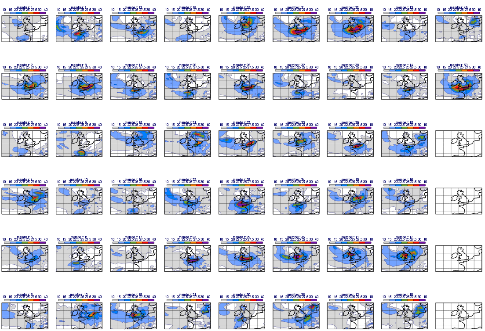

.. _case_study_ensemble_forecast:

Case study: Ensemble Forecast
#############################

**Download**

.. list-table::

  * - **File**
    - **Modified**

  * - File `ensemble forecast.tar.gz <https://confluence.ecmwf.int/download/attachments/45757078/ensemble forecast.tar.gz?api=v2>`_
    - Mar 19, 2015 by `Iain Russell <https://confluence.ecmwf.int/display/~cgi>`_

Case description
****************

In this exercise we will use Metview to explore the various ways ensemble forecasts can be processed and visualised. The case we will investigate is related to a low pressure system crossing the UK on 10 August 2014: it caused high winds and heavy rain especially in the South-Western part of the country.

.. note::

  This exercise involves:

  * reading and visualising ENS (Ensemble Prediction System) forecasts (in GRIB format)

  * performing fieldset computations in Macro

  * defining various layouts

  * customising the title for plots containing multiple fields

Evaluating the forecasts
************************

In this part of the exercise we will create the plot shown below:

In this plot each map contains various forecasts for the maximum 10 m wind gust in a 6-hour period:

* top left: the latest forecast before the event

* top right: the forecast run 4 days before the event

* bottom left: the ensemble mean for the ENS  forecast run 4 days before the event

* bottom right: the ensemble spread for the ENS forecasts run 4 days before the event

Setting the View
================

With a new *Geographical View* icon, set up a cylindrical projection with its area defined as

.. code-block:: python
  
  South/West/North/East: 43/-20/60/10
  
Set up a new `Coastlines <https://software.ecmwf.int/wiki/display/METV/Coastlines>`_ icon with the following:

* the land coloured in *cream*

* the coastlines *thick black*

* use *grey grid* lines at every 5 degrees.

Defining the layout
===================

With a new Display Window icon define a 2x2 layout so that each plot should contain your view. 

Visualising the latest forecast
===============================

The GRIB file *fc_latest_oper.grib *contains the latest forecast run preceding the event. 
Drag it into the top left map and customise it with the wgust_shade `Contouring <https://confluence.ecmwf.int/display/METV/Contouring>`_ icon and the title_oper `Text Plotting <https://confluence.ecmwf.int/display/METV/Text+Plotting>`_ icon. 
Animate through the fields to see the location of the areas heavily hit by the storm.

Visualising the operational forecast
====================================

The GRIB file fc_oper.grib contains the operational forecast run at 7 August 00 UTC (4 days before the event). Drag it into the top right map and customise it in the same way as the previous plot. You will see that the wind storm was not present in the forecast.

Visualising the ensemble mean
=============================

The GRIB file *fc_ens.grib* contains the control forecast member and the 50 perturbed members of the ENS run at 7 August 00 UTC (4 days before the event). 
We will compute and visualise the mean of the ensemble members using a Macro.
Create a new Macro and edit it. 
First, read the GRIB file in:

.. code-block:: python
  
  g=read("fc_ens.grib")

Our GRIB contains three time steps (78, 84 and 90 hours, respectively) and we would like to compute the ensemble mean for each one separately. 
To achieve this goal we will write a loop going through the time steps. 
First, define the fieldset that will contain the results

.. code-block:: python
  
  e_mean=nil

Next, add this piece of code to define the loop (we store the time steps in a ``list``):

.. code-block:: python
  
  tsLst=[78,84,90]
   
  loop step in tsLst
   
    ...your code will go here ...
   
  end loop
  
Within the loop, first, read all the 51 ENS members for the given time step:

.. code-block:: python
  
  f=read(data: g,
    step: step
  )   

Next, compute their mean with the ``mean()`` macro function:
  
.. code-block:: python
  
  f = mean(f)

Last, add this field to the resulting fieldset:
  
.. code-block:: python
  
  e_mean = e_mean & f

By doing so the loop's body is completed. We finish the macro by returning the resulting fieldset:

.. code-block:: python
  
  return e_mean

.. note::

  By using the return statement our Macro behaves as if it were a fieldset (GRIB file).

Drag your Macro into the bottom left map and customise it with the *wgust_shade* `Contouring <https://confluence.ecmwf.int/display/METV/Contouring>`_ icon. 
You would also need a custom `Text Plotting <https://confluence.ecmwf.int/display/METV/Text+Plotting>`_ icon for the title. 
Take a copy of the one used for the previous plots (called *title_oper*) and tailor it to your needs. 
When you analyse the plot you will notice that the ensemble mean hints for higher wind gusts in our area of interest.

Visualising the ensemble spread
===============================

The ensemble spread is the standard deviation of the ENS members. 
We can compute it in a very similar way to the ensemble mean. 
The only difference is that this time we need to use the ``stdev()`` function instead of ``mean()``. 
Now it is your task to write a Macro for it. 
Once you finished your Macro drag it into the bottom right map and customise it with the *wgust_spread_shade* `Contouring <https://confluence.ecmwf.int/display/METV/Contouring>`_ icon and with a custom `Text Plotting <https://confluence.ecmwf.int/display/METV/Text+Plotting>`_ icon. 
You will see that the ensemble spread is fairly high in the investigated area.

Checking the probabilities
**************************

In this part we will estimate the risk of the wind gust being higher than a certain threshold. We will compute the probability of the wind gust exceeding 22 m/s (about 80 km/h) and generate the plot shown below:

We will compute the probabilities with a Macro in a very similar way as we did for the ensemble mean (and standard deviation). 
The difference is that this time we need to compute a probability for each time step.

Now duplicate the ensemble mean Macro and edit it. 
Find the code line computing the mean and replace it with this code block:

.. code-block:: python
  
  f=f > 22    
  f=100*mean(f)

The first line in the code above, performs a logical operation on the fieldset and results in a new fieldset. 
In this new fieldset we have only **1s** and **0s**:

* the value is **1** in each gridpoint where the condition meets (i.e. the value is larger than the threshold)

* the value is **0** in all other gridpoints.

The second line simply derives the probability as the mean of these fields. 
We multiply the result by 100 to scale it into the 0-100 range for an easier interpretation.

Once you finished your Macro, visualise your *Geographical View* icon and drag the Macro into the  plot. 
Customise it with the *prob_shade* `Contouring <https://confluence.ecmwf.int/display/METV/Contouring>`_ icon. 
Also use a custom `Text Plotting <https://confluence.ecmwf.int/display/METV/Text+Plotting>`_ icon to define the title. As for the probabilities, you should see that there is some probability of high wind speeds.

Creating a stamp plot
*********************

In this part we will investigate the individual ENS members and create a plot showing them all for a given time step on the same page like this:

This plot, for an obvious reason, is called a stamp plot. 
This is a complex plot so we will write a Macro to generate it.

Create a new Macro and edit it. 
Drop your Geographical View and the `Coastlines <https://software.ecmwf.int/wiki/display/METV/Coastlines>`_ icons into the Macro editor. 
Once you've tidied up the code, define a 6x9 layout so that each plot should contain your view:

.. code-block:: python
  
  dw=plot_superpage(pages: mxn_layout(my_view,9,6))

Next, drop your *wgust_shade* `Contouring <https://confluence.ecmwf.int/display/METV/Contouring>`_ icon into the Macro editor and tidy up the generated code. 
We will apply this icon to all the fields in the stamp plot.
Continue with reading in the GRIB file of the ENS forecasts:

.. code-block:: python
  
  g=read("fc_ens.grib")

Define a variable to hold the time step we want to plot:

.. code-block:: python
  
  step = 90

The stamp plot will be generated by plotting each perturbed forecast member into a separate map, so we need to write a loop like this:

.. code-block:: python
  
  for i=1 to 50 do 
   
      ...your code will go here ...
   
  end for

Within the loop, simply read the current perturbed forecast member for the given time step:

.. code-block:: python
  
  f=read(data: g,
          number: i,
          type: "pf",
          step: step
        ) 
	
Next, define a title. 
The available space for the title in the plot is confined (we need to squeeze more than 50 maps into a page!) so the title should be short:

.. code-block:: python
  
  title = mtext(text_line_1 : "PF: " & i)

Last, plot the field into the right map in our layout:

.. code-block:: python
  
  plot(dw[i],title,f,wgust_shade)

Having done so we have finished the code inside the loop. 
Now visualise your Macro (this will take a minute or so) and try to identify the ENS members predicting high wind speeds in our area.

Creating a spaghetti plot
*************************

We finish the case study by looking into the predictability of the large scale flow pattern by generating spaghetti plots from the same ENS run as we investigated before. In a spaghetti plot each ENS member is rendered into the same map using a single isoline value. The plot we want to generate is shown below (it contains the spaghetti plot for 500 hPa geopotential using the 560 gpm isoline value):

This is a fairly complex plot and we will write a Macro to produce it.

Create a new Macro and edit it. 
Drop your *Geographical View* and the `Coastlines <https://software.ecmwf.int/wiki/display/METV/Coastlines>`_ icons into the Macro editor and change the map area to

.. code-block:: python
  
  [40,-40,70,20]

so that our map could show a larger (North Atlantic) area.

Next, define the contouring used for the "spaghetti" by dropping the *cont_spag* `Contouring <https://confluence.ecmwf.int/display/METV/Contouring>`_ icon into the Macro. A code like this should be generated for you:

.. code-block:: python
  
  cont_spag = mcont(
      contour_label: "off",
      contour_level_selection_type    :   "level_list",
      contour_level_list  :   560,
      contour_line_colour: "blue",
      contour_highlight: "off"
   )

In this ``mcont()`` we turned contour labels off to keep the plot uncluttered and defined only a single contour value (for 560 gpm).

Continue with reading in the GRIB file of the ENS forecasts used for the "spaghetti":

.. code-block:: python
  
   g = read("spag_ens.grib")

The "spaghetti" will be generated by plotting each perturbed forecasts member as a separate layer into the same map. To achieve this goal we need to write a loop like this:

.. code-block:: python
  
  for i=1 to 50 do 
   
      ...your code will go here ...
   
  end for

Within the loop, read all the perturbed forecast members for the all the time steps:

.. code-block:: python
  
  f=read(data: g,
      type: "pf", 
      number: i
   )  

By default, if no title definition is specified, Metview adds a title line for each field in the plot. 
Since we are about to plot 50 fields into the same map this would result in 50 titles in the plot! 
To avoid having too many titles we use a custom `Text Plotting <https://confluence.ecmwf.int/display/METV/Text+Plotting>`_ icon:

.. code-block:: python
  
  title=mtext(text_line_1: "Value: 560 gpm T+<grib_info key='step' where='number=50' /> h" )

Here we used the **where** statement inside the **grib_info** tag (`as described here <https://confluence.ecmwf.int/display/METV/Customising+Your+Plot+Title>`_)  to make the title appear for one member (the 50th member) only.

Last, plot the field with our contour settings and title:

.. code-block:: python
  
  plot(your_view,f,cont_spag,title) 

Having done so we have finished the code inside the loop. 
Now visualise your Macro (it will take half a minute or so) and animate through the steps to see how the spaghetti is spreading out over time.

Extra Work if You Have Time
***************************

Add more fields to the stamp plot
=================================

The stamp plot only shows the perturbed ENS members but there is still space left to display additional fields, as well. 
Try to add the control forecast (from ENS) and the operational forecast to it. 
Some hints:

* plot the control forecast into the 51st map (``dw[51]``). 
  The control forecast is stored in the same file as the perturbed forecast members: *fc_ens.grib*. 
  Read it in with this code:
  
  .. code-block:: python
  
    f = read(data: g, type: "cf", step: step)
  
* plot the operational forecast into the 52nd map (``dw[52]``). 
  The operational forecast is stored in *fc_oper.grib*. 
  Read it in with this code:

  .. code-block:: python
  
    f =read(source: "fc_oper.grib", step: step)

.. note::

  While setting up these extra plots it is a good idea to temporarily comment out the loop processing the perturbed forecast members.

Add more fields to the spaghetti plot
=====================================

The spaghetti plot only shows the perturbed ENS members. 
Try to add the control forecast (from ENS) and the operational forecast to it as well. 
You should use different isoline colours for them. 
Some hints:

* use a thick red contour line. 
  The control forecast is stored in the same file as the perturbed forecast members: *spag_ens.grib*. 
  Read it in with this code:
  
  .. code-block:: python
  
    f = read(data: g, type: "cf")

* use thick green contour line. 
  The operational forecast is stored in *spag_oper.grib*. 
  Read it in with this code:
  
  .. code-block:: python
  
    f = read("spag_oper.grib")

.. note::

  While setting up these extra plots it is a good idea to temporarily comment out the loop processing the perturbed forecast members.
