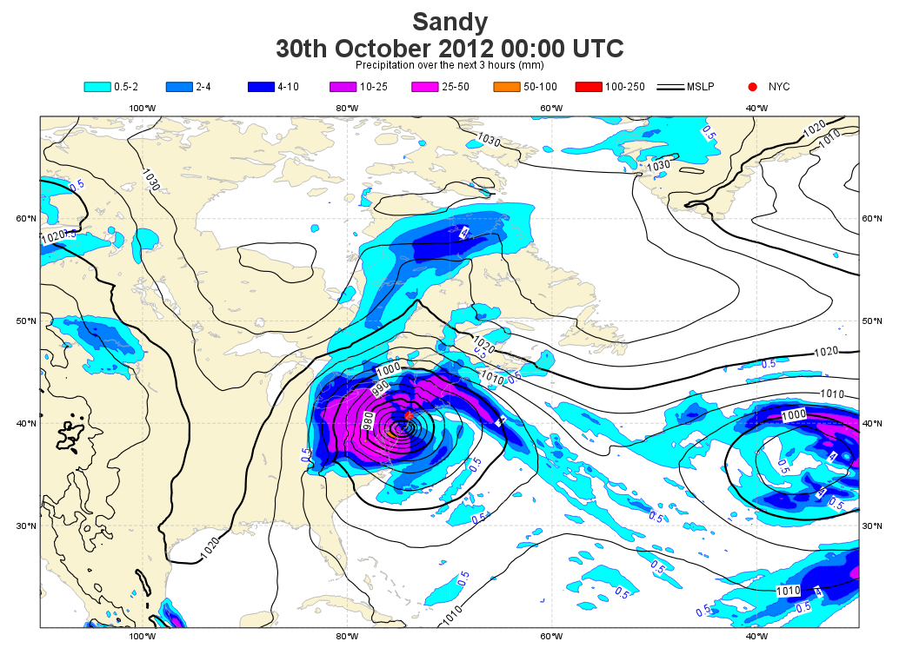

.. _case_study_plotting_hurricane_sandy_on_a_map:

Case Study: Plotting Hurricane Sandy on a Map
#############################################

Case description
****************

In this exercise we will apply the basic Metview techniques to produce the plot shown above: a map showing part of North America with precipitation and mean sea level pressure fields plotted during the time of Hurricane Sandy. 
We will also attach a marker to show a specific location on the map (New York City) and customise the legend and title.

Check that the supplied data are as expected.

We will prepare the plot interactively using icons. 
Then, at the end, we will put it all together into a macro. 
Remember to give your icons useful names!

**Download**

.. list-table::

  * - **File**
    - **Modified**

  * - ZIP Archive `contouring sandy.tar.gz <https://confluence.ecmwf.int/download/attachments/45754795/contouring sandy.tar.gz?api=v2>`_
    - Sep 08, 2016 by `Iain Russell <https://confluence.ecmwf.int/display/~cgi>`_

Steps
*****

Setting the View
================

With a new *Geographical View* icon, set up a cylindrical projection with its area defined by its lower-left corner [20oN, 110oW] and its upper-right corner [70oN, 30oW].

Set up a new `Coastlines <https://confluence.ecmwf.int/display/METV/Coastlines>`_ icon with the following:

* the land coloured in *cream*
* the coastlines in *grey*
* the grid as a *grey dashed line*

Plotting the Mean Sea Level Pressure field
==========================================

Plot the GRIB file *msl.grib* into this view using a new `Contouring <https://confluence.ecmwf.int/display/METV/Contouring>`_ icon. Plot black isolines with an interval of 5 hPa between them. 
Since this will be plotted on top of another field, it would also be a good idea to increase the thickness of the isolines. 
Activate the legend in the *Contouring* icon and set the legend text for this icon to "MSLP".

Plotting the Precipitation Field
================================

The GRIB file *precip.grib* contains a pre-processed field of precipitation accumulated over 3 hours before and after the time of the MSLP field (a total of 6 hours of precipitation).

.. note::

  GRIB files store their fields in SI units. 
  For precipitation this is metres, which is not what meteorologists tend to use. 
  Metview will normally automatically scale such parameters into their 'normal' units (in this case mm), but if a field is the result of some post-processing (as this one is) then this scaling will not be applied because the processing may have changed the nature of the field. 
  Here, the field is still precipitation, so we would like the normal scaling to be applied. 
  The Contouring icon has a parameter called **Grib Scaling of Derived Fields** which should be set to **On** in this case.

Plot the precipitation data using new *Contouring* icon. 
Do this in isolation from the MSLP field until you are happy with the result.

* use the following list of levels for contouring: 0.5, 2, 4, 10, 25, 50, 100, 250  (but remember that in the *Contouring* icon editor to use a forward slash to separate the items)

* use the following list of colours:  cyan, greenish_blue, blue, bluish_purple, magenta, orange, red, charcoal (use the **Contour Shade Colour List** helper tool)

* deactivate the contour highlight

* activate the legend

Overlaying Both Fields
======================

Visualise your *Geographical View* icon and drop the following icons into the **Display Window**:

* your *Coastlines* icon

* the *msl.grib* icon with your MSLP *Contouring* icon

* the *precip.grib* icon with your precipitation *Contouring* icon

Improving the Legend
====================

Create a new *Legend* icon and change **Legend Display Type** to **Disjoint**. 
Play with the font size and colour and set the legend title to say something about the precipitation field. 
Drop it into the **Display Window** to see the results.

Adding the Position of New York City
====================================

One easy way to add a place-mark is to use the `Input Visualiser <https://confluence.ecmwf.int/display/METV/Input+Visualiser>`_ icon and combine it with a `Symbol Plotting <https://confluence.ecmwf.int/display/METV/Symbol+Plotting>`_ icon.

Edit a new Input Visualiser icon and set the following:

.. list-table::

  * - **Input Plot Type**
    - Geo Points

  * - **Input Longitude Values**
    - -74

  * - **Input Latitude Values**
    - 40.71

Create a new *Symbol Plotting* icon to plot this as a red marker (the filled circle is marker index 28) with some text for its legend entry.

Adding a Custom Title
=====================

Using a *Text Plotting* icon, add a custom title as shown in the plot.

Generating a Macro to Reproduce the Plot
========================================

Generate a macro which will reproduce your plot with a single click. 
This can be done either by clicking the **Generate Macro** button from the **Display Window** or by editing a new *Macro* icon, dropping your data and visdef icons into it and adding a ``plot()`` command. 
Do it using the **Generate Macro** button and we will gain a little extra functionality for free. 
The generated macro will be called *MacroFramework1*; Metview rescans its folders every few seconds, so it might not appear immediately. 
Right-click and choose **visualise** to obtain our normal on-screen plot, or choose **execute** to generate a PDF file of the plot. 
Look at the generated Macro code to see how this is done! Different output formats will be studied in more depth in `Working with graphical output <https://confluence.ecmwf.int/display/METV/Working+with+graphical+output>`_.

Overlaying Both Fields

Visualise your *Geographical View* icon and drop the following icons into the **Display Window**:

* your *Coastlines* icon

the *msl.grib* icon with your MSLP *Contouring* icon

* the *precip.grib* icon with your precipitation *Contouring* icon

Extra Work
**********

Try the following if you have time.

Add another location marker
===========================

Washington DC is quite close, at coordinates 38.5N, 77W. 
Create another *Input Visualiser* icon (or make a copy of the New York one) and set these co-ordinates. 
Create another *Symbol Plotting* icon to plot this marker in green and ensure it has a correct name in its legend entry. 
Drop the two icons into your existing plot.

Using the cursor data to examine the grid point values
======================================================

Activate the Cursor Data tool and see what it shows you when you have multiple data layers in your plot. 
Note that both sets of data are scaled from their units in the GRIB files.

Experiment with different contouring schemes
============================================

The precipitation could of course be shaded differently - try some different colour schemes.

By setting **Contour Min Level** to 5, you can choose to quickly show only those areas with 5mm or more precipitation (look at a global map to see all of these areas).

Metview has a built-in facility for using the same contouring styles for certain fields as `ecCharts <http://eccharts.ecmwf.int/forecaster/>`_ does. 
Create a new *Contouring* icon and set **Contour Automatic Setting** to Ecchart and **Grib Scaling of Derived Fields** to On. 
With this setting, various parameters from the GRIB data are used to choose a contouring style (if it exists in the ecCharts style library). 
In fact, this same icon can be used for both fields!

Ensuring the title has the correct date and time
================================================

There are various ways we can ensure that the title has the date and time according to the actual data. 
The default title in fact contains the date and time, but in this exercise we want more control over it.
Construct the second line of the title by extracting the date and time from the MSLP field and converting into an appropriate string - do this in the Macro code.

Hints:

* this procedure will be covered in `Customising Your Plot Title <https://confluence.ecmwf.int/display/METV/Customising+Your+Plot+Title>`_

* if you have a fieldset variable called ``msl_grib``, the following line will extract the date at which the field is valid:

  * ``msl_date = valid_date(msl_grib)``
  
* use the ``string()`` function to construct a date string similar to the one used in the current title

  * see `String Functions <https://confluence.ecmwf.int/display/METV/String+Functions>`_ for details of how to use it
  
* insert this into the ``mtext()`` function instead of the current title  (ensure that we read the msl data and extract its date *before* defining the title)

* it is now more robust - if you use data from a different date or time, the title will still be correct

* note that this method will not work directly if you want to generate an animation from different time steps of data

Experiment with different backgrounds and projections
=====================================================

Modify the *Coastlines* icon, for example:

* plot the US state boundaries

* try different land or sea shading colours

* change the frequency of the grid lines

Try a different *Geographical View* icon and set the projection to, for example, Mollweide. 
Drop this into the plot, then update the macro to use this new view (to do this, edit the macro, then drop your view icon into the editor towards the bottom of the code, where the view is defined; a little editing will be required to use your new view instead of the original one).
