Data Part 1
###########

**Download**

.. list-table::

  * - **File**
    - **Modified**

  * - ZIP Archive `data 1.tar.gz <https://confluence.ecmwf.int/download/attachments/45756991/data 1.tar.gz?api=v2>`_
    - Sep 08, 2016 by `Iain Russell <https://confluence.ecmwf.int/display/~cgi>`_

  * - File `ztuv.grb <https://confluence.ecmwf.int/download/attachments/45756991/ztuv.grb?api=v2>`_
    - Sep 08, 2016 by `Iain Russell <https://confluence.ecmwf.int/display/~cgi>`_

Getting Data into Metview
*************************

Copying files and creating links
================================

By default, Metview can only see files under the ``$HOME/metview`` directory. 
You can select a different home directory for Metview (``-u`` option on the Metview startup command line), but you can also copy files into this directory (or a sub-directory of it) or create links to external data files - this can be useful if you have large data files which would exceed the quota in your home directory.

One way is to do this from a shell command line (``ln`` command), but Metview can also create these links for you.
 
Right-click an empty spot in the Metview desktop and choose **Create New...** **Link to File** and type /home/ectrain/trx/mv_data/ztuv.grb into the **File name** box (or navigate there and select the file with the mouse). 
Note that the text label under the new icon is in italics, and there is an arrow in the bottom-left corner - these indicate that this is a link; if you hover the mouse cursor over the icon, the link details will be shown in the status bar. 
The padlock in the bottom-right corner tells us that this file is read-only. 
This file contains analysis and 1, 2, 3, 4 and 5-day forecasts for geopotential, temperature and wind at various pressure levels - **visualise** it to see for yourself.

You can create links to individual files or complete folders. This facility can be used to share folders between users.

Retrieving data from MARS
=========================

Metview has the ability to retrieve data directly from the ECMWF MARS archive (or indeed any other MARS archive installed outside ECMWF). 
Metview can also retrieve data from certain data sets without much special setup using the `MARS Web API <https://confluence.ecmwf.int/display/METV/Using+the+MARS+Web+API+from+Metview>`_.

Create a new *Mars Retrieval* icon. 
Edit it and set only the following:

.. list-table::

  * - **Grid**
    - 1.5/1.5

This ensures that the data is transformed onto a regular 1.5 degree grid. Much of Metview's functionality relies on GRIB data being on a grid (regular or quasi-regular) and not stored as spherical harmonics.
If you look at the other parameters in the icon editor, you will see that by default, it will retrieve analysis data (**Type** = An) of geopotential (**Param** = Z) on six pressure levels (**Levelist** = 1000/850/700/500/400/300) for yesterday (**Date** = -1).

Save the icon, then **visualise** it. 
The data should be retrieved, then visualised. From the titles of the different fields in the plot you can confirm that it is the correct data.

We will see in `Processing Data <https://confluence.ecmwf.int/display/METV/Processing+Data>`_ how we can manipulate the data returned from MARS.

Icon Feedback
=============

The *Mars Retrieval* icon gives us the opportunity to explore another feature of Metview. 
The colour of an icon\u2019s text label tells us which state it is in:

.. list-table::

  * - Black
    - No operation executed since last save (default)

  * - .. raw:: html
  
        Orange  
    - Operation in progress, e.g. waiting for data retrieval from database

  * - .. raw:: html 

        Green	
    - Operation successfully executed, data may be cached for some icons

  * - .. raw:: html 

        Red	
    - Operation failed, e.g. due to invalid input parameters

The icon should currently be green, meaning that if you visualise it (or perform any other action on it), the data will not be retrieved again - the cached copy will be used instead. 
There are two ways to un-cache the data:

1. edit the icon and change at least one parameter (in this case, the cached data will no longer match the retrieval request, so it is deleted)
2. right-click on the icon and select **Clear result**

Use the second technique, then **execute** the icon and observe as the colour of its name changes.

Icon Output
===========

By now you should have generated some log message, probably when you performed the MARS retrieval. 
Each icon has its own text output which can be viewed by selecting **Log** from the icon's right-click menu. 
This is only enabled when there is output for that icon, and is reset when the icon's contents change. 
Have a look at the log messages for the *Mars Retrieval icon* (ensure that you have retrieved data first).

You can view a complete history of output from all icons by selecting **Log** from the **Tools** menu in any **Metview desktop**.

For an even more detailed output, you can start Metview on the command line with the '-slog' option - this will write lots of information to your terminal window. This information can be useful when reporting a problem to the Metview team! '``metview -h``' gives a list of all useful command line options and environment variables.

Downloading files from URLs
===========================

Metview's *Download* module provides the means to download a file from an arbitrary URL.

Create a new *Download* icon, edit it and set:

.. list-table::

  * - **Url**
  
    - http://download.ecmwf.org/test-data/metview/gallery/2m_temperature.grib

**Visualise** the icon to retrieve the file and plot it. 
If there was a problem with the URL then look at the icon's log messages.

Saving results to disk
======================

The data files cached by these icons will be removed when the current Metview session is terminated. 
To store a permanent copy, right-click on the icon and select **Save result**. 
Try this with either your *Mars Retrieval* or your *Download* icon.

Field Data in GRIB Files
************************

ECMWF's model output fields are stored in GRIB format, so that is where much of Metview's functionality lies. 
The following sections will introduce some of the data inspection facilities available.

Examining GRIB Meta-data
========================

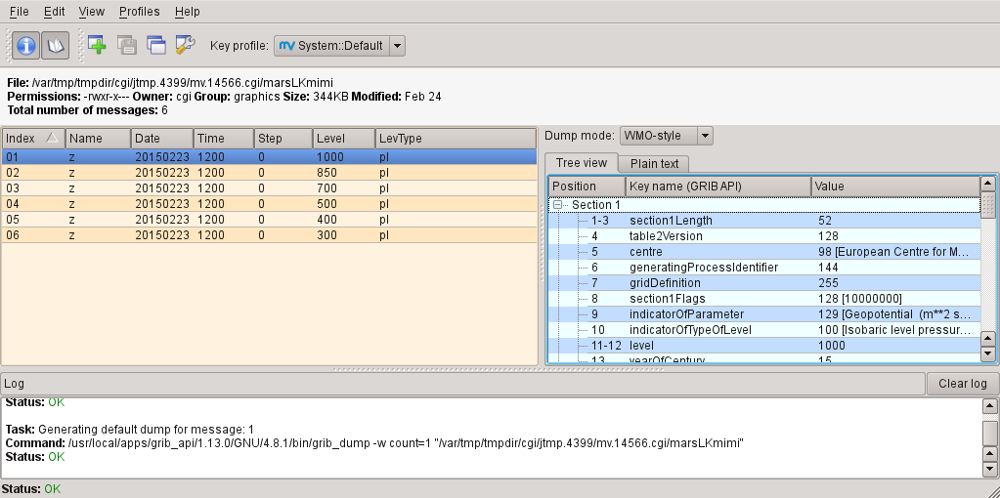

Right-click and **Examine** the *Mars Retrieval* icon (if for some reason the retrieval did not work, or you do not have access to MARS, then use *ztuv.grb* instead).

GRIB file. In this case we have 6 fields (messages) in the file, each represented by a row in the message list on the left-hand side. 
The right-hand side shows detailed meta-information for the selected message, presented in a number of different ways (try changing between **Tree view** and **Plain text**; try different **Dump modes**). 
You can sort the fields by clicking on the different column headers. 
The GRIB Examiner can be customised \u2013 see the extra tasks for this chapter, as this is an advanced topic.

Filtering GRIB Data
===================

Metview provides powerful data filtering capabilities. Let\u2019s take our ztuv.grb file and extract the forecast and analysis data separately from it.

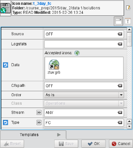

Create a new *GRIB Filter* icon. 
This time we'll rename it from within the icon editor (just to show an alternative way to rename an icon). 
Edit the icon, and notice the button to the right of the information panel; click it and change the name of the icon to *t_3day_fc* - we will use this icon to extract only the 3-day forecast data for temperature.

First, we specify the input data. 
Drag the *ztuv.grb* icon into the **Data** field of the editor. 
This is an *icon field* - an area where you can drop other icons. Now set the following parameters to extract just the 3-day (72-hour) temperature forecast:

.. list-table::

  * - **Type**
    - FC or Forecast

  * - **Param**
    - T or Temperature

  * - **Step**
    - 72

**Visualise** this icon and verify that it returns only the data we expect.
Now create a new *GRIB Filter* icon, rename it *t_an* and use it to extract only the temperature analysis data:

.. list-table::

  * - **Type**
    - AN or Analysis

  * - **Param**
    - T or Temperature

It is quite often the case that GRIB data comes as several fields in the same file, and using the GRIB Filter icon is an easy way to extract just the fields you want without making copies of the file. This icon also has some parameters to perform some post-processing on the data, which we will cover in `Processing Data <https://confluence.ecmwf.int/display/METV/Processing+Data>`_.

Plotting Grid Values
--------------------

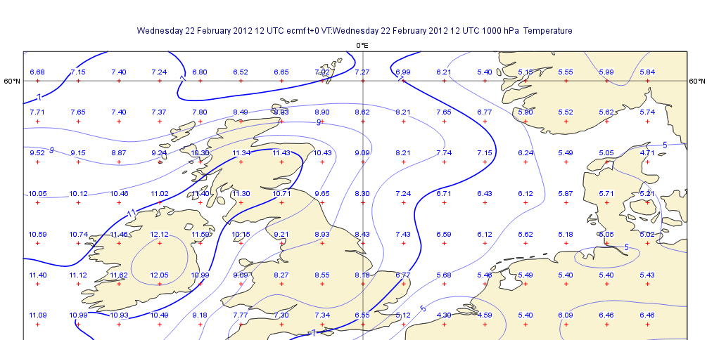

We will now plot the actual grid values. 
Create a new *Contour* icon and rename it *grid_10x10*. 
Edit it and find the set of parameters close to the bottom of the editor which control the plotting of grid values. 
Activate grid value plotting, set it to plot **both** values and markers, and set the lat/lon frequency each to 10. 
Visualise a scalar field (temperature or geopotential) from *ztuv.grb* and apply the new visdef icon to it - you will see every 10th grid point plotted. If you wish, you can also deactivate the isolines by setting **Conotur** to Off.

If you zoom into smaller areas, you may want to see every grid point - duplicate *grid_10x10* and call it *grid_1x1*. 
Set the lat/lon frequency to 1 - one fast way to do this is to click on the **blue 'revert' button** next to the parameter. 
This button does two things: it indicates that a parameter has been altered from its default, and it restores the parameter to its default when clicked.

.. note::

  Note that plotting every grid point value for a global plot of a high-resolution field can be slow; it also results in an unreadable plot, so it is not recommended!

Cursor Data
-----------

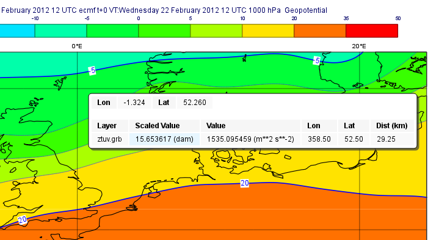

As already seen in `A Simple Visualisation <https://confluence.ecmwf.int/display/METV/A+Simple+Visualisation>`_, the Cursor Data can also be used to inspect grid point values. 
Activate it and check it against the plotted values!

Scattered Data in Geopoints files
*********************************

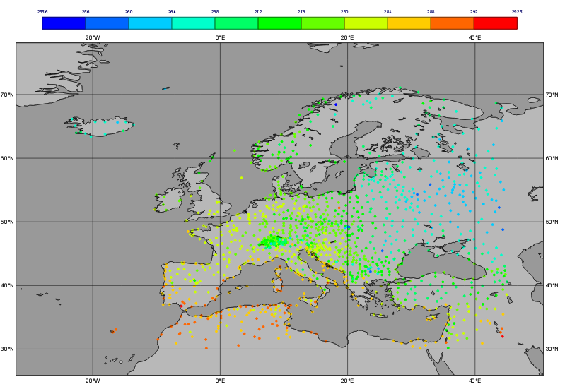

Format overview
===============

`Geopoints <https://software.ecmwf.int/wiki/display/METV/Geopoints>`_ is the ASCII format used by Metview to handle spatially irregular data (e.g. observations). There are a number of variations on the format, but the default one is a 6-column layout. The columns do not have to be aligned, but there must be at least one whitespace character between each entry.

This example shows a geopoints file containing dry bulb temperature at 2m (PARAMETER = 12004).

.. list-table::

  * - #GEO
  * - PARAMETER = 12004

.. list-table::

  * - lat        
    - long     
    - level    
    - date     
    - time
    - value

  * - #DATA
    - 
    - 
    - 
    - 
    - 

  * - 36.15
    - -5.35
    - 0
    - 19970810
    - 1200
    - 300.9

  * - 34.58
    - 32.98
    - 0
    - 19970810
    - 1200
    - 301.60

  * - 41.97
    - 21.65
    - 0
    - 19970810
    - 1200
    - 299.4

  * - 45.03
    - 7.73
    - 0
    - 19970810
    - 1200
    - 294

  * - 5.67
    - 9.7
    - 0
    - 19970810
    - 1200
    - 302.2   
    
  * - 444.43
    - 9.93
    - 0
    - 19970810
    - 1200
    - 293.4

If you have observation data which you wish to import into Metview, Geopoints is probably the best format because:

1. it is easy to write data into this format
2. Metview has lots of `functions <https://software.ecmwf.int/wiki/display/METV/Geopoints+Functions>`_ to manipulate data in this format

Variants of the format allow 2-dimensional variables to be stored (e.g. U/V or speed/direction wind components), and another variant stores only lat, lon and value for a more compact file.

Examining geopoints
===================

Examine the supplied *geopoints.gpt* icon to confirm the contents of the file. 
The columns are sortable. You may wish to open the file in an external text editor to see exactly what it looks like.

Visualising geopoints
=====================

Visualise the icon. 
The visdef used for geopoints is `Symbol Plotting <https://software.ecmwf.int/wiki/display/METV/Symbol+Plotting>`_, and its default behaviour is to plot the actual numbers on the map. 
This can become cluttered, and text rendering can be slow. 
Create a new *Symbol Plotting* icon and set the following parameters:

.. list-table::

  * - **Legend**
    - On

  * - **Symbol Type**
    - Marker

  * - **Symbol Table Mode**
    - Advanced

  * - **Symbol Advanced Table Max Level Colour**
    - Red

  * - **Symbol Advanced Table Min Level Colour**
    - Blue

  * - **Symbol Advanced Table Max Colour Direction**
    - Clockwise

Rename the icon to *symb_auto* and drop it into the **Display Window** to see the points coloured according to their value.

Computing some statistics in Macro
==================================

First, we will print some information about our geopoints data. 
Create a new *Macro* icon, type this code and run it:

.. code-block::

  gp = read('geopoints.gpt')
  print('Num points: ', count(gp))
  print('Min value: ', minvalue(gp))
  print('Max value: ', maxvalue(gp))

Perform a simple data manipulation and return the result to Metview's user interface:

.. code-block::

  return gp*100

Save the macro and see its result by right-clicking on its icon and choosing **examine** or **visualise**. 
We could also have put a ``write()`` command into the macro to write the result to a geopoints file.

Finding geopoints points within 100km of a given location
=========================================================

As a more complex example, we will combine two functions in order to find the locations of the points within a certain distance of a given location. 
We will use the same geopoints file as before.

The ``distance()`` function returns a new geopoints variable based on its input geopoints, where each point's value has been replaced by the distance of that point from the given location. 
The description of this function follows:

.. code-block::

  geopoints distance ( geopoints,number,number )
  geopoints distance ( geopoints,list )

  Returns geopoints with the value of each point being the distance in metres from the given
  geographical location. The location may be specified by supplying either two numbers 
  (latitude and longitude respectively) or a 2-element list containing latitude and longitude
  in that order. The location should be specified in degrees.

Choose a location and use this function to compute the distances of the data points from it. 
Assign the result to a variable called ``distances`` and return it to the user interface to examine the numbers. 
The distances are in metres.

Now we will see a boolean operator in action. The expression distances < ``100000`` (one hundred thousand) will return a new geopoints variable where, for each point, if the input value was less than ``100000``, the resulting value will be 1; otherwise the resulting value will be zero. 
So the resulting geopoints will have a collection of ones and zeros. 
Confirm that this is the case.

The ``filter()`` function, from the documentation:

.. code-block::

  geopoints filter ( geopoints,geopoints )
  
  A filter function to extract a subset of its geopoints input using a second geopoints as 
  criteria. The two input geopoints must have the same number of values. The resulting output 
  geopoints contains the values of the first geopoints where the value of the second geopoints 
  is non-zero. It is usefully employed in conjunction with the comparison operators :
  
  freeze = filter(temperature,temperature < 273.15)
  
  The variable ``freeze`` will contain a subset of temperature where the value is below 
  ``273.15``.

Use this in combination with what you have already done to produce a geopoints variable consisting only of the points within 100km of your chosen location. Plot the result to confirm it.

Saving geopoints data
=====================

Geopoints variables can be saved to disk using the write() command:

.. code-block::

  write('my_computed_data.gpt', points)

It is also possible to convert between geopoints and GRIB format - this will be covered in `Processing Data <https://confluence.ecmwf.int/display/METV/Processing+Data>`_.

Observation Data in BUFR files
******************************

Much observation data is received in BUFR format. 
BUFR is a complex format, capable of storing almost anything; BUFR files can vary widely, but there are some conventions which can help software to interpret them. 
We will have a brief overview of Metview's BUFR-handling capabilities here; for more information, see the dedicated tutorial on the `Tutorials <https://confluence.ecmwf.int/display/METV/Tutorials>`_ page.

Examining BUFR Meta-data
========================

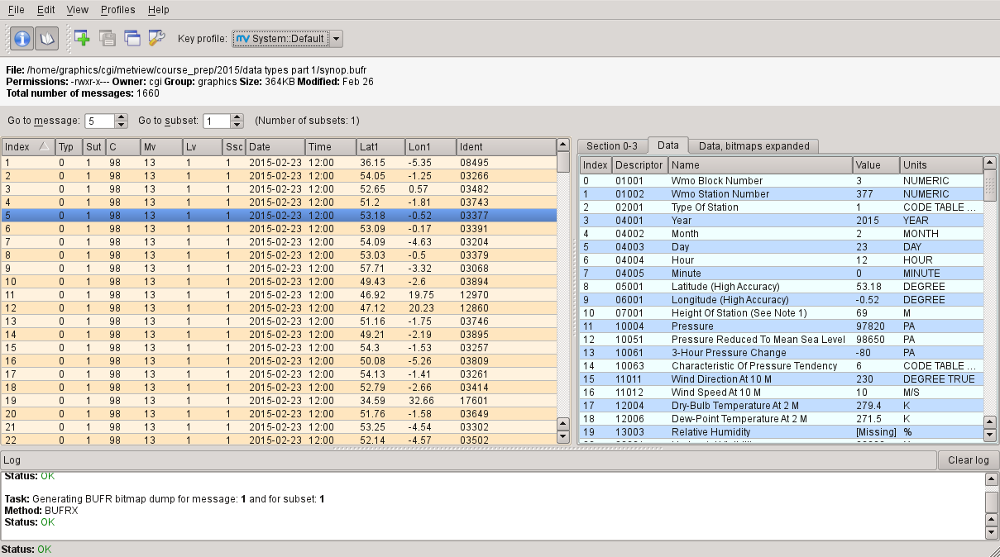

Right-click on the supplied synop.bufr BUFR icon and select examine from the icon menu. This will start the BUFR examiner application. The right-hand panel displays data for the message selected in the left-hand panel. This can be an easy way to find the correct descriptor for a given parameter such as Relative Humidity.

Plotting BUFR Data
==================

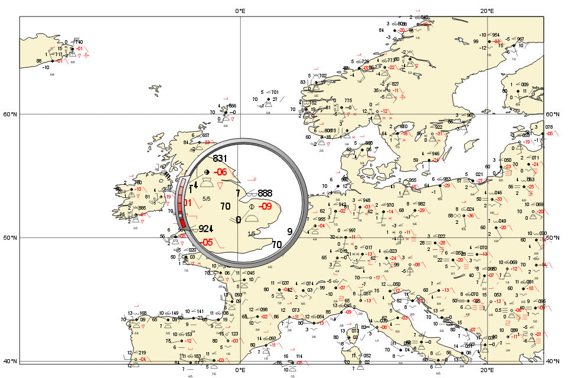

Metview is able to plot certain BUFR data directly, mainly some WMO conventional observation types including SYNOP and TEMP.

Right-click and **visualise** the *synop.bufr* BUFR icon. 
This will bring up the **Display Window** using the default visualisation assigned to observation plotting. 
What we see here is a spatially thinned set of SYNOP observations plotted on the map by using the official WMO-style. 
If you zoom into a smaller area you will see more observations but the thinning is still kept so that the plot should not seem cluttered.

Filtering Observation Data
==========================

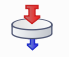

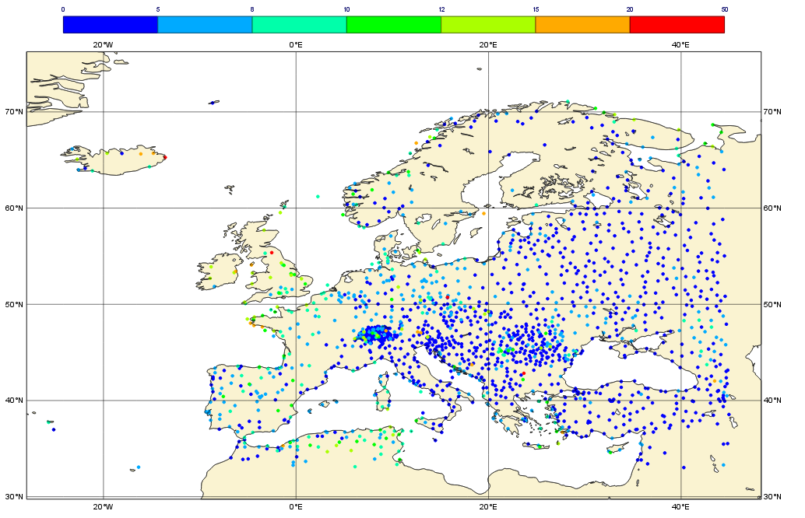

BUFR files can contain a lot of information, but we often want to extract just one or two parameters.

The *Observation Filter* icon extracts a single scalar or vector value from each message in a BUFR file. 
It is able to perform filtering according to message type, date, time, level, area, location and custom descriptors. 
Examine the BUFR file and find the descriptor for wind speed at 10m (look in the blue right-hand panel) - make a note of it.

Create a new *Observation Filter* icon, rename it to *wind_speed* and edit it. 
Drop the BUFR icon into the **Data** field and set the following to extract the wind speed values in geopoints format:

.. list-table::

  * - **Output**
    - Geographical Points

  * - **Parameter**
    - 11012

Visualise the icon - the filtering will take place, then the result is plotted using the default `Symbol Plotting <https://confluence.ecmwf.int/display/METV/Symbol+Plotting>`_ definition, which is to plot the data as numbers. 
Drop your *symb_auto* icon into the **Display Window** for a nicer plot.

Notice that there is a point which claims a wind speed of 80m/s! Reliability can be a big issue with observational data, and this point claims winds of 288km/h! We can filter out data that we consider unrealistic - add the following parameters to your *wind_speed* icon:

.. list-table::

  * - **Custom Filter**
    - Filter By Range

  * - **Custom Parameter**
    - 11012

  * - **Custom Values**
    - 0/50

This ensures that we only extract points whose wind speed is between 0 and 50 (m/s). 
Having a smaller range of values also allows the automatic colour range to spread more evenly through the data. 
There is still a point with a large value, which you can also filter out if desired.

Notice that the values in the colour scale change as you zoom in and out of different areas - *this is computed according to the data currently visible*. 
Try the supplied icon *symb_wind_speed_fixed*, which has a fixed value/colour mapping.

Extracting vector values from BUFR
----------------------------------

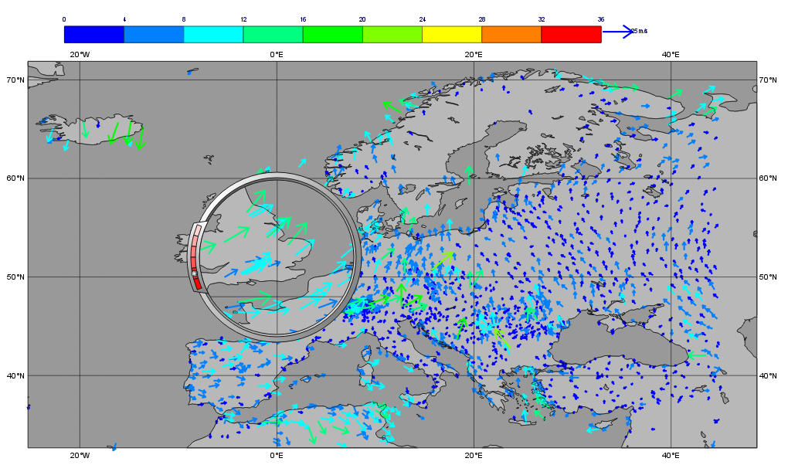

We can extract the wind direction too, and plot the wind as arrows (or flags).

Make a copy of your *wind_speed* filter icon and call it *wind_speed_and_direction*. 
Find out which descriptor provides wind direction, then change the following parameters in your new filter icon:

.. list-table::

  * - **Output**
    - Geographical Polar Vectors

  * - **Parameter**
    - 11012/?????

where ????? is replaced by the wind direction descriptor number.

When you visualise the icon, you will see numbers as before, but if you drop a newly created `Wind Plotting <https://confluence.ecmwf.int/display/METV/Wind+Plotting>`_ icon into the **Display Window** you will see wind arrows. 
Try the supplied *coloured_wind_arrows* icon too. 
Try changing it to plot wind flags instead of arrows.
You may wish to customise a *Coastlines* icon to provide a darker background for the plot.

Extra Tasks
***********

Write a macro to plot the wind arrows from BUFR
===============================================

Use the icons you created to filter and plot the wind arrows from BUFR data to write a macro which produces the same plot. 
Extract the 'magic numbers' such as the filtering threshold and the wind parameter descriptors into variables at the top of the macro, and use these variables in the macro rather than the raw numbers.

Investigate different grids
===========================

GRIB fields are often not as simple as regular lat/lon! ECMWF also produces data in "reduced Gaussian grids", two of which are included in your folder. Visualise them with your *grid_1x1* icon to see how the points are spaced around the globe. 
Use both a cylindrical and a polar stereographic projection to look at them (*Geographic View* icon).

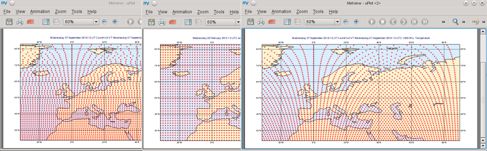

Try the search facilities in the data examiners
===============================================

Examine the GRIB file and the BUFR file; press CTRL-F to initiate the search. Look carefully at the options!

Create your own GRIB Examiner key profile
=========================================

When you examine a GRIB file, a list of 'keys' is used to display the GRIB messages - one key per column. 
These columns are configurable - a 'key profile' is a set of keys, and you can create as many of them as you want. 
It can be very useful to have different key profiles for different tasks. 
From the user interface in the GRIB Examiner, create a new key profile; starting either from scratch, or else from a duplicate of the default profile. 
Note that the **Display Window** also operates on the same principles, and you can share key profiles between the two.

Observation filtering
=====================

Extract 2m temperature values below the freezing point from *synop.bufr*.

Hints:

* use geopoints output
* use custom filter
* temperature values are given in K
