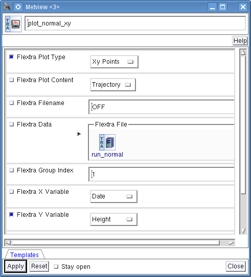

.. _flextra_tutorial:

FLEXTRA tutorial
################
 
This tutorial explains how to use the FLEXTRA trajectory model within Metview.

.. note::

  **Requirements**
  
  Please note that this tutorial requires Metview version **5.0** or later.

Preparations
************

First start Metview; at ECMWF, the command to use is metview (see `Metview at ECMWF <https://confluence.ecmwf.int/display/METV/Metview+at+ECMWF>`_ for details of Metview versions). 
You should see the main Metview desktop popping up.

You will create some icons yourself, but some are supplied for you - please download the following file:

**Download**

.. list-table::

  * `flextra_tutorial.tar.gz <http://download.ecmwf.org/test-data/metview/tutorial/flextra_tutorial.tar.gz>`_

and save it in your ``$HOME/metview`` directory. 
You should see it appear on your main Metview desktop, from where you can right-click on it, then choose **execute** to extract the files.

Alternatively, if at ECMWF then you can copy it like this from the command line:

  ``cp -R /home/graphics/cgx/tutorials/flextra_tutorial ~/metview``
  
You should now (after a few seconds) see a *flexta*_*tutorial* folder which contains the solutions and also some additional icons required by these exercises. 
You will work in the *flextra_tutorial* folder so open it up. 
You should see the following contents:
    

About FLEXTRA
*************

What is FLEXTRA?
================

**FLEXTRA** is an atmospheric trajectory model used by a large user community. It can be driven by meteorological input data from a variety of global and regional models including ECMWF analyses and forecasts.

FLEXTRA can compute both **forward** and **backward** trajectories using **various trajectory types** such as: three-dimensional, model level, mixing layer, isobaric and isentropic trajectories. 
Trajectory computations can be carried out in the three different modes. 
These are as follows:

1. In **NORMAL** mode, a group of trajectories is specified starting from the same point but at different times. Several starting points (thus several groups of trajectories) can be defined for a single FLEXTRA run.

2. In **CET** mode, trajectories are generated starting from the points of a user-defined uniform grid in a three-dimensional domain.

3. In **FLIGHT** mode, both the starting location and starting time for each trajectory can be set individually. This mode is useful to calculate e.g. trajectories along the flight track of an aircraft.

.. note::

  FLEXTRA is a **free software** system released under the GNU General Public License V3.0. 
  The joint homepage of FLEXTRA and FLEXPART (a Lagrangian particle dispersion model) is hosted by the **Norwegian Institute for Air Research** (NILU) and available at the following address:
  
    `http://transport.nilu.no/flexpart <http://transport.nilu.no/flexpart>`_

    This website contains a link to the latest available FLEXTRA documentation:
    
    `http://zardoz.nilu.no/~andreas/flextra/flextra3.html <http://zardoz.nilu.no/~andreas/flextra/flextra3.html>`_

.. note::

  Please note that FLEXTRA is not an ECMWF development. 
  **FLEXTRA** is **not distributed with Metview**, but it has to be downloaded from the web site specified above and installed separately. 
  It is installed at ECMWF though (see details `here <https://confluence.ecmwf.int/display/METV/FLEXTRA+at+ECMWF>`_).

About the Metview interface
===========================

Metview provides a high level interface to prepare input data for FLEXTRA, run FLEXTRA and visualise the resulting output files. 
The interface was developed and tested with **version 5.0 of FLEXTRA**, which is using GRIB API to handle GRIB2 fields.

The input file generation and visualisation do not require the existence of a FLEXTRA executable. 
However, FLEXTRA itself can be only run if an executable is present. 
The path to the FLEXTRA executable can be specified for Metview at installation time by setting the --with-flextra switch for configure. 
However, this path can be overridden at Metview start-up via the **MV_FLEXTRA_EXE** environment variable.

FLEXTRA is controlled through a set of parameter files which are all generated automatically by Metview in the background. 
The only exception is file AVAILABLE which can optionally be provided by the users (see *Part 3* for details).

The Input Data
**************

The input data needed to run the examples of this tutorial is already prepared for you and located in folder *Data*. Here you find a set of GRIB files starting with the string "EN". 
These files are valid for the period of 2012-01-11 00 UTC to 2012-01-15 00 UTC. 
There is the AVAILABLE file here as well. 
It is a parameter file telling FLEXTRA the names and dates of the input GRIB files.

This dataset was generated through the Metview FLEXTRA interface.The chapter on `data preparation <https://confluence.ecmwf.int/pages/viewpage.action?pageId=146637830#FLEXTRAtutorial-data_preparation>`_ explains how it works and helps prepare your own dataset if it is needed.

Running FLEXTRA
***************

In this exercise we will see how to compute trajectories with FLEXTRA in **NORMAL** run mode. In NORMAL mode we can generate a group of trajectories starting from the same point but at different times. Please open folder *normal* inside folder *flextra_tutorial* to start the work.

The FLEXTRA Run Icon
====================

To compute trajectories with FLEXTRA we need to use the *FLEXTRA Run* icon (right-click in the desktop when no icons are selected and use the **New icon...** menu).

Rename it 'run_normal' and open up its editor.

First, set the input data parameters:

.. list-table::

  * - **Flextra Input Mode**
    - Path
    
  * - **Flextra Input Data Path**
    - ../data
    
  * - **Flextra Available File Path**
    - SAME_AS_INPUT_PATH

The selected option ('Path') for parameter **Flextra Input Mode** indicates that we want to specify the input data and the AVAILABLE file by their paths. 
Because the AVAILABLE file is also located in the same directory as the input data we simply set parameter Flextra Available File Path to SAME_AS_INPUT_PATH (it is the default value). 
Otherwise the full path to the AVAILABLE file should have been typed in.

In the next step we will specify the starting dates of the group of trajectories we want to generate:

.. list-table::
    
  * - **Flextra Run Mode**
    - Normal
  
  * - **Flextra Trajectory Direction**
    - Forward
  
  * - **Flextra Trajectory Length**
    - 72
  
  * - **Flextra First Starting Date**
    - 20120111
  
  * - **Flextra First Starting Time**
    - 3
  
  * - **Flextra Last Starting Date**
    - 20120111
  
  * - **Flextra Last Starting Time**
    - 15
  
  * - **Flextra Starting Time Interval**
    - 3
  
  * - **Flextra Output Interval Mode**
    - Interval
  
  * - **Flextra Output Interval Value**
    - 3

Here we set the run mode to 'NORMAL' and defined a set of forward trajectories starting on 11 January 2012 at 3, 9,12 and 15 UTC. 
We set the length of the trajectories to 72 h and specified that the output data (i.e. trajectory waypoints) will be written out every three hours.

.. note::

  **First step omitted**
  
  FLEXTRA cannot start the computations from the very first available date and time. So we could not start from 2012-01-11 00 UTC (the first available date and time in our data) but had to use the next available step (3h).
  
The last step is to define the starting point parameters:

.. list-table::

  * - **Flextra Normal Types**
    - 1

  * - **Flextra Normal Names**
    - Katla

  * - **Flextra Normal Latitudes**
    - 63.63

  * - **Flextra Normal Longitudes**
    - -19.05

  * - **Flextra Normal Levels**
    - 1512

  * - **Flextra Normal Level Units**
    - 1

With these settings we specified the trajectory type to be three-dimensional (see below for the list of IDs for trajectory types) and set the starting point to volcano Katla (on Iceland) with the height of 1512m.

.. note::

  **Formatting time**
  
  The format of parameters holding dates is **yyyymmdd**. 
  Any dates having less than 8 digits are interpreted as relative dates. E.g, -1 = yesterday, 0 = today, 1 = tomorrow etc.
  
  The format of parameters holdings times is **hh:mm:ss** with the following rules:
  
  * If mm:ss is omitted it defaults to hh (without the colon!). E,g. 12 = 12 h
  
  * The leading zero is not mandatory for hh. E.g.: 2 = 2 h
  
  * If ss is omitted it defaults to hh:mm. E.g. 12:30 = 12 h 30 m
  
  Parameters **Flextra Trajectory Length**, **Flextra Starting Time Interval** and **Flextra Output Interval Value** have the format of **hhh:mm:ss.** 
  The following rules apply:
  
  * If ss is omitted it defaults to hhh:mm. E.g. "120:30" = 120 h 30 m 0 s
  
  * If mm:ss is omitted it defaults to hhh. E.g. 120 = 120 h
  
  * The leading zero is not mandatory for hhh. E.g.: 12 = 12 h

.. note::

  **Trajectory types and levels**
  
  We set the **trajectory type** by its ID. 
  The possible values are as follows:
  
    1. Three-dimensional
  
    2. Model layer
  
    3. Mixing layer
  
    4. Isobaric
  
    5. Isentropic
  
  The **level units** were also given by an ID. 
  The possible values are as follows:
  
    1. Metres above sea level
    
    2. Metres above ground level
    
    3. Hectopascals

Parameter **Flextra Output Interval Mode** controls how the trajectory points are written out into the output file. It can have three values:

  * **Original**: The trajectory points are written out into the output file exactly at the computational time steps. 
    In the FLEXTRA terminology these are called **flexible time steps**.
  
  * **Interval**: The trajectory points are written out into the output file at regular intervals specified by parameter **Flextra Output Interval Value**. 
    In the FLEXTRA terminology these are called **constant time steps**.
    
  * **Both**: Two output files will be generated: one for the flexible time steps and one for the constant time steps (in *Part 11* we will see how to deal with multiple FLEXTRA outputs).
  
We only specified one starting point but in the chapter on `multiple_outputs <https://confluence.ecmwf.int/pages/viewpage.action?pageId=146637830#FLEXTRAtutorial-multiple_output>`_ we will see how to work with multiple starting points for a NORMAL run.

.. note::

  **GRIB2 input fields**
  If **global GRIB2** input fields generated by Metview are used in **FLEXTRA 5** it incorrectly detects the domain and treats it as a limited area. 
  As a consequence trajectories cannot cross the domain boundaries because the computation stops at the border.

Running FLEXTRA
===============

Save your *FLEXTRA Run* icon (**Apply**) then right-click and **execute** to start the trajectory computations. Within a minute (it might take longer on your machine) the icon should turn green indicating that the run was successful and the results have been cached.

The FLEXTRA File icon
=====================

Our FLEXTRA run generated an ASCII file on output which is now represented by our *FLEXTRA Run* icon. 
Right-click and **examine** the icon to look to see its content. 
This action will start up a window showing the output generated by FLEXTRA. 
What you are looking at is a custom ASCII format describing the resulting trajectories and some metadata.

.. note::

  **FLEXTRA stop index**
  Flextra assigns an exit code called **stop index** for each trajectory. 
  Its value can be seen in the FLEXTRA output (the examiner highlights it in blue in the trajectory header). 
  The possible values are as follows:
  
    1. Normal exit.
    
    2. The trajectory left the computation domain.
    
    3. The time difference between two wind fields was too large.
    
    4. No wind fields were available.

Now close the FLEXTRA examiner. 
Right-click and **save** the icon to get a local copy of the FLEXTRA output file. 
A **File Save** dialog will appear with a **Selection** box at the bottom where you can specify the output file name. 
Type here 'res_normal.txt' and click **Ok**. 
After a few seconds a *FLEXTRA File* icon with the selected name will appear in your folder.

This icon now stores your FLEXTRA output data. You can check its content by right-click and **examine** or **edit**.

.. note::

  Saving the results into a file is not essential for using trajectories in Metview but allows you to have a local copy of the results for further processing outside Metview.
  
  Be aware that **cached data gets deleted on exiting** Metview. 
  It means that the trajectory result data stored by the *FLEXTRA RUN* icon will be deleted between two Metview sessions. 
  Therefore, especially if the computations take a long time, it is worth saving the results into a file.

Visualisation On Maps
*********************

In this exercise we will visualise the trajectories that we computed in the previous chapter. 
We will work in folder 'normal' again.

The FLEXTRA Visualiser Icon
===========================

To visualise your FLEXTRA output you need to use a *FLEXTRA Visualiser* icon.

Create a new *FLEXTRA Visualiser* icon and rename it 'plot_normal'. 
Edit it and drop your 'run_normal' *FLEXTRA Run* icon into the **Flextra Data** field. 
This specifies the FLEXTRA output to be visualised. 
(Please note that you could also have dropped your 'res_normal.txt' *FLEXTRA File* icon into the **FLEXTRA Data** field to specify the data to be plotted).

At this point we do not need to set any other parameters the default values will work for us. 
After these modifications your icon editor should look like this.

Visualising the Icon
====================

Save your *FLEXTRA Visualiser* icon (**Apply**) then right-click and **visualise** to plot the trajectories. 
This will bring up the Metview **Display Window** using a custom visualisation assigned to FLEXTRA files.

What you are looking at is a global map (it might be different for you depending on your *Map View* settings) on which the trajectories are hard to see. 
There is a *Map View* icon called 'map_Katla' prepared for you in the folder and we suggest that you drop it into the plot to get the right area and a shaded map background as well (alternatively you can zoom into this area).The first thing to note in the plot is the title. 
It reads as

.. code-block:: python
  
  FLEXTRA: Forward 3D 1512m Katla (-19.05,63.63)
  
telling us that we visualised a set of 3D forward trajectories starting from the point called 'Katla'. 
The legend contains the starting date, time and elevation for each trajectory.

Now click on the 'plot_normal' layer in the **Layers** tab (on the right hand side of the plot window). 
If you change the view by clicking on the **View metadata** toggle button

you will see the meta-data associated with the visualised trajectories.

Customising the Plot
====================

Our plot was generated by using hard-coded symbol plotting settings for trajectory rendering. 
Now we will change these settings and learn how to customise the graphical properties of individual trajectories.

To start with, we have to be aware that Metview assigns an integer ID to each trajectory before it gets visualised. The numbering starts at 1 and the original trajectory order is kept. 
In this way we assign the value of 1 to all the points in the first trajectory. 
We assign the value of 2 to the points if the second trajectory and so on for the rest of the trajectories. 
Then in the visualisation Metview uses symbol plotting to assign different graphical attributes to different values i.e. for different trajectories.

To see how it is working in detail let's create a `Symbol Plotting <https://confluence.ecmwf.int/display/METV/Symbol+Plotting>`_ icon. Rename it 'symbol' then edit it.

First, we need to set the symbol plotting type:

.. list-table::

  * - **Legend**
    - On

  * - **Symbol Type**
    - Marker

  * - **Symbol Table Mode**
    - Advanced

With these settings we will plot markers (symbols) in the plot. 
We also set **Symbol Table Mode** to 'Advanced' so that we can define value intervals to which a separate maker type, colour and size can be assigned. 
We will construct these intervals by using the trajectory IDs. 
In this way the points of a given trajectory will all belong to the same interval.

The next step is to set the line properties:

.. list-table::

  * - **Symbol Connect Line**
    - On

  * - **Symbol Connect Automatic Line Colour**
    - On

This means that we will connect the points of a given trajectory and use the same colour for the lines as for the symbols they connect.

The intervals should be set carefully so that each trajectory ID (we have five trajectories with IDs ranging from one to five) should have a separate interval:

.. list-table::

  * - **Symbol Advanced Table Selection Type**
    - Interval

  * - **Symbol Advanced Table Min Value**
    - 1
  
  * - **Symbol Advanced Table Max Value**
    - 6

  * - **Symbol Advanced Table Interval**
    - 1
    
The settings above define the following intervals:
  
.. code-block:: python
  
  [1,2),[2,3),[3,4),[4,5),[5,6).
  
Please note intervals in symbol plotting are always closed on left and open on the right.

The last step is to specify the graphical properties we want to assign to the intervals:

.. list-table::

  * - **Symbol Advanced Table Max Level Colour**
    - Cyan

  * - **Symbol Advanced Table Min Level Colour**
    - Blue

  * - **Symbol Advanced Table Colour Direction**
    - Clockwise

  * - **Symbol Advanced Table Marker List**
    - 15/18/12/14/15

  * - **Symbol Advanced Table Height List**
    - 0.4
  
With these settings we will automatically generate our colour palette from a colour wheel by interpolating in clockwise direction between **Symbol Advanced Table Min Level Colour** and **Symbol Advanced Table Max Level Colour**.

The markers used to denote the trajectory points are defined by parameter **Symbol Advanced Table Marker List** (see below for the list of available markers).

Now save your changes and drop this icon into the plot to see the effect of the settings.

The identifiers of the available symbol markers are summarised in the table below:

Visualisation on XY Plots
*************************

In this exercise we will display the temporal evolution of the height of the trajectories we computed in *Part 3*. We will generate a graph plot with having the date as the horizontal axis and the height as the vertical axis. 
We will work in folder 'normal' again.

Creating a FLEXTRA Visualiser Icon
==================================

The visualisation is based on the *FLEXTRA Visualiser* icon just like in the case of the map-based plotting in the previous exercise (*Part 4* ).

Create a new *FLEXTRA Visualiser* icon and rename it 'plot_normal_xy' then open its editor.

First, set **Flextra Plot Type** to 'Xy Points' to indicate that we want to plot symbols in a Cartesian co-ordinate system.

Second, drop your 'run_normal' *FLEXTRA Run* icon into the **Flextra Data** field. 
This specifies the FLEXTRA output to be visualised.

Last, we need to specify the data to be used for the x-axis and y-axis, respectively. 
Here we set **Flextra X Variable** to 'Date' and **Flextra Y Variable** to 'Height'.

After these modifications your icon editor should look like this.

Visualising the Icon
====================

Save your *FLEXTRA Visualiser* icon (**Apply**) then right-click and **visualise** to plot the trajectories.

The Metview **Display Window** is popping up using a custom visualisation assigned to FLEXTRA files. 
The title and a legend have been built exactly in the same way as in the map-based visualisation (see *Part 4*).

Customising the Plot
====================

Our plot was generated by using hard-coded symbol plotting settings for trajectory rendering. 
We can change these settings exactly in the same way as we did for our map-based plot (see *Part 4* for details). 
Now we will not create a new icon but simply reuse the *Symbol Plotting* icon called 'symbol' we created in *Part 4*. 
Drop this icon into the plot to see the effect of the settings.

Changing the View
=================

We will further customise the plot by changing the axis value ranges and adding axis labels and grid-lines to it. 
To change these properties we need a *Cartesian View* icon. 
This time you do not need to create a new icon since there is one called 'xy_view' already prepared for you. 
Edit his icon to see how the view is constructed (please note that the axis properties are defined via the embedded *Horizontal Axis* and *Vertical Axis* icons). 
Then simply drag it into the **Display Window** and see how you plot has been changed.

Backward Trajectories
*********************

In this exercise we will see how to compute **backward** trajectories with FLEXTRA in **NORMAL** run mode. 
We will work in folder 'normal' again.

Creating a FLEXTRA Run Icon
===========================

Copy your 'run_normal' *FLEXTRA Run* icon (either right-click + **duplicate**, or drag with the middle mouse button), and rename the duplicate 'run_normal_back' by clicking on its title. 
Open its editor and start editing the date and time related parameters (the input data parameters are already set correctly for us so we do not need to change them):

.. list-table::

  * - **Flextra Run Mode**
    - Normal

  * - **Flextra Trajectory Direction**
    - Backward

  * - **Flextra Trajectory Length**
    - 72

  * - **Flextra First Starting Date**
    - 20120114

  * - **Flextra First Starting Time**
    - 3

  * - **Flextra Last Starting Date**
    - 20120114

  * - **Flextra Last Starting Time**
    - 15

  * - **Flextra Starting Time Interval**
    - 3

  * - **Flextra Output Interval Mode**
    - Interval

  * - **Flextra Output Interval Value**
    - 3

Here we set the run mode to 'NORMAL' and defined a set of backward trajectories ending on 14 January 2012 at 3, 9,12 and 15 UTC. The trajectory length will be 72 h and the output data (i.e. trajectory waypoints) will be written out every three hours.

We finish the editing by setting the end point parameters:

.. list-table::

  * - **Flextra Normal Types**
    - 1

  * - **Flextra Normal Names**
    - Reading

  * - **Flextra Normal Latitudes**
    - 51.45

  * - **Flextra Normal Longitudes**
    - -0.97

  * - **Flextra Normal Levels**
    - 1500

  * - **Flextra Normal Level Units**
    - 1
  
We selected Reading as the end point and set the height to 1500 metres. 
We defined the trajectory type to be three-dimensional.

Running FLEXTRA
===============

Save your *FLEXTRA Run* icon (**Apply**) then right-click and **execute** to start the trajectory computations. 
Within a minute (it might take longer on your machines) the icon should turn green indicating that the run was successful and the results have been cached. Right-click and **examine** the icon to look at its content. 
Please note that the first data column contains negative values indicating that we computed backward trajectories.

Visualising the Results
=======================

We can visualise the results in exactly the same way as we did in the previous chapter.

Create a new *FLEXTRA Visualiser* icon. 
Edit it and drop your 'normal_run_back' *FLEXTRA Run* icon into the **Flextra Data** field. 
Now save your settings (**Apply**) then right-click and **visualise** to plot the trajectories. 
After zooming into the proper area (or dropping the map_Reading icon into the plot) you should see something like this.

CET Run Mode
************

In this exercise we will see how to compute trajectories with FLEXTRA in **CET** run mode. 
In this mode we can generate a set of trajectories starting from the points of a uniform three-dimensional grid. Please open folder 'cet' inside 'flextra_tutorial' to start the work.

Creating a FLEXTRA Run Icon
===========================

Create a new *FLEXTRA Run* icon and rename it 'run_cet' then open its editor.

First, we need to set the input data parameters (in the same way as we did it in *Part 3*):

.. list-table::

  * - **Flextra Input Mode**
    - Path

  * - **Flextra Input Data Path**
    - ../data

  * - **Flextra Available File Path**
    - SAME_AS_INPUT_PATH

In the next step we will specify the run mode and some global parameters valid for all the trajectories:

.. list-table::

  * - **Flextra Run Mode**
    - Cet

  * - **Flextra Trajectory Direction**
    - Forward

  * - **Flextra Trajectory Length**
    - 72

  * - **Flextra First Starting Date**
    - 20120111

  * - **Flextra First Starting Time**
    - 3

  * - **Flextra Last Starting Date**
    - 20120111

  * - **Flextra Last Starting Time**
    - 3

  * - **Flextra Output Interval Mode**
    - Interval

  * - **Flextra Output Interval Value**
    - 3
  
Here we set the run mode to 'CET' and defined a set of forward trajectories starting on 11 January 2012 at 3 UTC. 
The trajectory length will be 72 h and the output data (i.e. trajectory waypoints) will be written out every three hours. 
Please note that for simplicity we defined only one starting time (of course we could have defined multiple ones just like in the previous chapters).

We finish the editing by setting the starting point grid:

.. list-table::

  * - **Flextra Cet Type**
    - 3d

  * - **Flextra Cet Name**
    - Katla

  * - **Flextra Cet Area**
    - 63.63/-19.05/63.63/-19.05

  * - **Flextra Cet Dx**
    - 1
    
  * - **Flextra Cet Dy**
    - 1

  * - **Flextra Cet Top Level**
    - 3000

  * - **Flextra Cet Bottom Level**
    - 1500

  * - **Flextra Cet Dz**
    - 500

  * - **Flextra Cet Level Units**
    - Metres ASL
  
With these settings we defined a horizontal grid with only one point (exactly at the position of volcano Katla) and specified four vertical layers from 1500 to 3000 m above seal level.

Running FLEXTRA
===============

Save your *FLEXTRA Run* icon (**Apply**) then right-click and **execute** to start the trajectory computations. 
Within a minute (it might take longer on your machines) the icon should turn green indicating that the run was successful and the results have been cached. Right-click and **examine** the icon to look at its content.

Visualising the Results
=======================

We can visualise the results in exactly the same way as we did in the previous chapters.

Create a new *FLEXTRA Visualiser* icon. 
Edit it and drop your 'run_cet' *FLEXTRA Run* icon into the **Flextra Data** field. 
Now save your settings (**Apply**) then right-click and **visualise** to plot the trajectories. 
After zooming into the proper area (or dropping the map_Katla *Map View* icon into the plot) you should see something like this.

FLIGHT Run Mode
***************

In this exercise we will see how to compute trajectories with FLEXTRA in **FLIGHT** run mode. 
In this mode, we can specify the starting location and starting time for each trajectory individually. 
It is useful to calculate, for instance, trajectories along the flight track of an aircraft. 
Please open folder 'flight' inside 'flextra_tutorial' to start the work.

Creating a FLEXTRA Run Icon
===========================

Create a new *FLEXTRA Run* icon and rename it 'run_flight' then open its editor.

First, we need to set the input data parameters (in the same way as we did it in *Part 3* ):

.. list-table::

  * - Flextra Input Mode**-Path

  * - **Flextra Input Data Path**
    - ../data

  * - **Flextra Available File Path**
    - SAME_AS_INPUT_PATH
  
In the next step we will specify the run mode and some global parameters valid for all the trajectories:

.. list-table::

  * - **Flextra Run Mode**
    - Flight

  * - **Flextra Trajectory Direction**
    - Forward

  * - **Flextra Trajectory Length**
    - 72

  * - **Flextra Output Interval Mode**
    - Interval

  * - **Flextra Output Interval Value**
    - 3

Here we set the run mode to 'FLIGHT' and defined a set of forward trajectories with the length of 72 h. 
The output data (i.e. trajectory waypoints) will be written out every three hours. 
Please note that this time we did not define any starting dates because in FLIGHT mode each starting point has its own starting date (see below). 
So parameters like **Flextra First Starting Date** etc. are disabled.

We finish the editing by setting the starting points, dates and times:

.. list-table::

  * - **Flextra Flight Type**
    - 3d

  * - **Flextra Flight Name**
    - track

  * - **Flextra Flight Latitudes**
    - 60/50/40

  * - **Flextra Flight Longitudes**
    - -15/0/15

  * - **Flextra Flight Levels**
    - 5000/12000/5000

  * - **Flextra Flight Level Units**
    - Metres ASL

  * - **Flextra Flight Starting Dates**
    - 20120111/20120111/20120111

  * - **Flextra Flight Starting Times**
    - 3/6/9

Here we set the trajectory mode to 'FLIGHT' and defined an imaginary flight track called 'track' with 3 points each being valid at a different time.

Running FLEXTRA
===============

Save your *FLEXTRA Run* icon (**Apply**) then right-click and **execute** to start the trajectory computations. 
Within a minute (it might take longer on your machine) the icon should turn green indicating that the run was successful and the results have been cached. 
Right-click and **examine** the icon to look at its content.

Visualising the Results
=======================

We can visualise the results in exactly the same way as we did in the previous chapter.Create a new *FLEXTRA Visualiser* icon. 
Edit it and drop your 'run_flight' *FLEXTRA Run* icon into the **Flextra Data** field. 
Now save your settings (**Apply**) then right-click and **visualise** to plot the trajectories. 
After zooming into the proper area (or dropping the map_Eu icon *Map View* into the plot) you should see something like this.

Using Macro
***********

In this example we will write the macro equivalent of the exercise we solved in *Part 3* and *Part 4* : we will compute forward trajectories with FLEXTRA in the NORMAL run mode and then visualise them. 
Please open folder 'normal' inside 'flextra_tutorial' to start the work.

Basics
======

The implementation of FLEXTRA-related operations in Metview macro follow the same principles as in the interactive mode. In macro we work with the macro command equivalents of the FLEXTRA icons we have seen so far:

  * *FLEXTRA File* icon: its corresponding macro commands are **read()** and **write()**.
  
  * *FLEXTRA Run* icon: its corresponding macro command is **flextra_run()**.
  
  * *FLEXTRA Visualiser* icon: its corresponding macro command is **flextra_visualiser()**.
  
There is also a macro equivalent command for icon FLEXTRA Prepare, which is used to prepare input data for FLEXTRA. Please see the chapter on `data preparation <https://confluence.ecmwf.int/pages/viewpage.action?pageId=146637830#FLEXTRAtutorial-data_preparation>`_ for details on it.

Automatic macro generation
==========================

The quickest way to generate a macro is to simply save a visualisation on screen as a *Macro* icon. 
Visualise your 'plot_normal' *FLEXTRA Visualiser* icon again and click on the macro icon in the tool bar of the **Display Window**.

Now a new *Macro* icon called 'MacroFramework*N*' is generated in your folder. 
Right-click **visualise** this icon. Now you should see your original plot reproduced.

.. note::

  This automatically generated macro is to be used primarily as a framework. 
  Depending on the complexity of the plot macros generated in this way may not work as expected and in such cases you may need to fine-tune them manually.
  It is recommended to use an alternative way and **write our own macro in the macro editor**.

Step 1 - Writing a macro
========================

Since we already have all the icons for our example we will not write the macro from scratch but instead we drop the icons into the **Macro editor** and just re-edit the automatically generated code.

Create a new *Macro* icon and rename it 'step1'.

When you open the **Macro editor** (right-click **edit**) you can see that the first line contains #Metview Macro. Having this special comment in the first line helps Metview to identify the file as a macro, so we want to keep this comment here.

Position the cursor in the editor a few lines below the line of #Metview Macro. 
By doing so we specify the position where the code for the icons we drop into the editor will be placed. 
Then drop your 'plot_normal' *FLEXTRA Visualiser* icon into the **Macro editor**. 
You should see something like this (after removing the comment lines starting with # Importing): 
 
.. code-block:: python
  
  #Metview Macro 
   
  run_normal = flextra_run(
      flextra_input_mode : "path",
      flextra_input_path : "/scratch/graphics/cgr/flextra_data",
      flextra_trajectory_length : 720000,
      flextra_first_starting_date : 20120111,
      flextra_first_starting_time : 030000,
      flextra_last_starting_date : 20120111,
      flextra_last_starting_time : 150000,
      flextra_starting_time_interval : 030000,
      flextra_normal_types : 1,
      flextra_normal_names : "Katla",
      flextra_normal_latitudes : 63.63,
      flextra_normal_longitudes : -19.05,
      flextra_normal_levels : 1512,
      flextra_normal_level_units : 1
   ) 
   
  plot_normal = flextra_visualiser(
      flextra_data : run_normal
   ) 
  
You only have to add the following command to the macro to plot the result:

.. code-block:: python
  
  plot(plot_normal) 
  
Now, if you execute this macro (right-click **execute** or click on the **Play** button in the **Macro editor**), Metview will run FLEXTRA to compute the trajectories and you should see a **Display Window** popping up with the default FLEXTRA visualisation.

Step 2 - Saving and Reading FLEXTRA Data
========================================

Duplicate the 'step1' *Macro* icon (right-click **duplicate)** and rename the duplicate 'step2'. In this step we will see how to save (write) our FLEXTRA results into a file and read it back into a local variable in order to avoid restarting the FLEXTRA computations every time we change something in the macro.

The macro should look like this:

.. code-block:: python
  
  #Metview Macro 
   
  resFile="res_normal_macro.txt" 
  if not(exist(resFile)) then 
      run_normal = flextra_run(
        ...
      ) 
   
      write(resFile,run_normal)
  else
      run_normal=read(resFile)
  end if 
   
  plot_normal = flextra_visualiser(
      flextra_data : run_normal
  ) 
   
  plot(plot_normal) 
  
Our code now contains an ``if`` statement to check if the FLEXTRA output file exits. 
If it does not exist we run FLEXTRA to compute the trajectories and save the resulting data into this file using the write() function. 
Otherwise we read the file from the disk with the ``read()`` function into our ``run_normal`` variable.

Run this macro to make sure that it is working (a *FLEXTRA File* icon called 'res_normal_macro.txt' should appear in the folder). 
Then run it again to see that the execution time really became shorter because we bypassed the FLEXTRA trajectory computations.

Step 3 - Customising the Visualisation
======================================

Duplicate the 'step2' *Macro* icon (right-click **duplicate)** and rename the duplicate 'step3'. 
In this step we will change our symbol plotting settings and the map area as well.

Position the cursor above the plot() command in the **Macro editor** and drop your 'symbol' icon into it. 
Repeat with the 'map_Katla' icon. Then modify the plot() command by adding these new arguments to it:  

.. code-block:: python
  
  plot(map_Katla,plot_normal,symbol) 
  
Now, if you run this macro you should see your modified plot in the **Display Window**.

Data Access in Macro
********************

In this example we will see how to read metadata and data from our FLEXTRA outputs. 
We will get to know the usage of two FLEXTRA-specific macro functions: **flextra_group_get()** and **flextra_tr_get()**, respectively. 
Please open folder 'metadata' in folder 'flextra_tutorial' to start the work.

Step 1 - Using Group Metadata
=============================

In this exercise we will read some metadata from our FLEXTRA output and use it to customise our plot's title.

Create a new *Macro* icon and rename it 'step1' then open its editor. 
We start the macro with reading our FLEXTRA output file that we generated in *Part 3* (for you convenience there is a copy of it in your current folder):

.. code-block:: python
  
  #Metview Macro 
   
  flx=read("res_normal.txt") 
  
Now variable ``flx`` holds all the data of our FLEXTRA output. 
We continue by adding the following code to the macro:

.. code-block:: python
  
  vals=flextra_group_get(flx, ["type","direction","name",
      "startLat","startLon","dx","dy"]) 
  
Here we used function flextra_group_get() to read the values for a list of metadata keys from the FLEXTRA output. 
This function accesses metadata that is valid for the whole group of trajectories we have (remember that we have several trajectories in our output). 
We will use the retrieved string values to build a custom title:
 
.. code-block:: python
  
  titleTxt="Type: " & vals[1] & " " & vals[2] & " Point: " &
              vals[3] & " Lat: " & vals[4] & " Lon: " & vals[5] &
              " Grid: " & vals[6] & "x" & vals[7] 
   
  title=mtext(text_line_1 : titleTxt) 
  
The next step is to define a visualiser 
 
.. code-block:: python
  
  flx_plot=flextra_visualiser(flextra_data: flx) 
  
Finally we add our objects to the ``plot()`` command: 
 
.. code-block:: python
  
  plot(flx_plot,title) 
  
If you run this macro you should see your plot with the custom title in the **Display Window**.

.. note::

  1. Function flextra_group_get() returns values only for those metadata keys which have the same value for all the trajectories in the group. If this condition is not fulfilled the function returns a ``nil`` value. 
     For example in our FLEXTRA output each trajectory has a different starting time. 
     So if we specified key ``startTime`` for ``flextra_group_get()`` it would return a ``nil`` value for it.
  
  2. The second argument of flextra_group_get() can also be a single key (instead of a list of keys). 
     In this case the return value is a string (instead of a list).
  
Please find below the list of the metadata keys used by ``flextra_group_get()``:

.. list-table::

  * - **Key**
    - **Description**
    - **Might get a nil value**

  * - **cflSpace**
    - Spatial CFL criterion.
    -

  * - **cflTime**
    - Temporal CFL criterion.
    -

  * - **direction**
    - Trajectory direction.
    -

  * - **dx**
    - West-east resolution of the input grid.
    -

  * - **dy**
    - North-south resolution of the input grid.
    -

  * - **east**
    - Eastern border of the input grid.
    -

  * - **integration**
    - Integration scheme.
    -

  * - **interpolation**
    - Interpolation type.
    -

  * - **maxInterval**
    - The maximum interval between input fields.
    -

  * - **name**
    - The name of group (= 'startComment').
    -

  * - **normalInterval**
    - The normal interval between input fields.
    -

  * - **north**
    - Northern border of the input grid.
    -

  * - **runComment**
    - Label for the FLEXTRA run.
    -

  * - **south**
    - Southern border of the input grid.
    -

  * - **startComment**
    - The name of the trajectory group (= 'name').
    -

  * - **startDate**
    - Date of starting points.
    - X

  * - **startEta**
    - Model level of starting points.
    - X

  * - **startLat**
    - Latitude of starting points.
    - X

  * - **startLon**
    - Longitude of starting points.
    - X

  * - **startPres**
    - Pressure of starting points.
    - X

  * - **startPv**
    - Potential vorticity of starting points.
    - X

  * - **startTheta**
    - Potential temperature of starting points.
    - X

  * - **startTime**
    - Time of starting points.
    - X

  * - **startZ**
    - Height (above sea) of starting points.
    - X

  * - **startZAboveGround**
    - Height (above ground) of starting points.
    - X

  * - **trNum**
    - Number of trajectories in the group.
    -

  * - **type**
    - Trajectory type.
    -

  * - **west**
    - Western border of the input grid.
    -

Step 2 - Accessing Individual Trajectory Data
=============================================

In this step we will show how to access the metadata and data of individual trajectories.

Create a new *Macro* icon and rename it 'step2'. 
Just like in the previous step the macro starts with reading our FLEXTRA output file.
 
.. code-block:: python
  
  #Metview Macro 
   
  flx=read("res_normal.txt") 
  
Now variable flx holds all the data in our FLEXTRA output. 
At first we will find out the number of trajectories we have.  
  
.. code-block:: python
  
  num=number(flextra_group_get(flx,"trNum"))
  
Here we used function flextra_group_get() to read the value of the number of trajectories. 
We also used function number() to convert the string flextra_group_get() returns into a number.

Now we will create a for loop to go though all the trajectories in the group and extract and print some data from them:

.. code-block:: python
  
  for i=1 to num do
      vals=flextra_tr_get(flx,i,["startTime","stopIndex"])
      print("tr: ",i," time: ",vals[1]," stop: ",vals[2])
  end for 
  
Here we used function flextra_tr_get() to read the value for a list of metadata keys from the i-th trajectory in the FLEXTRA output.

The next step is to read the actual data values from a given trajectory. It goes like this:
   
.. code-block:: python
  
  vals=flextra_tr_get(flx,1,["date","lat","lon"]
  
Here we read the date, latitude and longitude data from the first rajectory. 
What flextra_tr_get() returns is a list that contains either a vector or a list for a given key. 
For date we get a lists of dates, while for lat and lon we get vectors. 
Finally, we load the results into another set of variables and print their values out in a loop.

.. code-block:: python
  
  dt=vals[1]
  lat=vals[2]
  lon=vals[3] 
   
  for i=1 to count(dt) do
      print(dt[i]," ",lat[i]," ",lon[i])
  end for 
  
Now, if you run this macro you will see the data values appearing in the standard output.

.. note::

  The second argument of flextra_tr_get() can also be a single key (instead of a list of keys). 
  In this case the function returns either a single string value, a list or a vector depending of the key specified.

Please find below the list of the metadata keys used by ``flextra_tr_get()``:

.. list-table::

  * - **Key**
    - **Description**
    - **Return value**

  * - **date**
    - Date.
    - list of dates

  * - **eta**
    - Model level.
    - vector

  * - **lat**
    - Latitude.
    - vector

  * - **lon**
    - Longitude.
    - vector

  * - **pres**
    - Pressure.
    - vector

  * - **pv**
    - Potential vorticity.
    - vector

  * - **startDate**
    - Date of starting point.
    - string

  * - **startEta**
    - Model level of starting point.
    - string

  * - **startLat**
    - Latitude of starting point.
    - string

  * - **startLon**
    - Longitude of starting point.
    - string

  * - **startPres**
    - Pressure of starting point.
    - string

  * - **startPv**
    - Potential vorticity of starting point.
    - string

  * - **startTheta**
    - Potential temperature of starting point.
    - string

  * - **startTime**
    - Time of starting point.
    - string

  * - **startZ**
    - Height (above sea) of starting point
    - string

  * - **startZAboveGround**
    - Height (above ground) of starting point
    - string

  * - **stopIndex**
    - Stop index of computations.
    - string

  * - **theta**
    - Potential temperature.
    - vector

  * - **z**
    - Height above sea level.
    - vector

  * - **zAboveGroundLevel**
    - Height above ground level.
    - vector

Multiple Outputs
****************

In this exercise we will see how to deal with multiple output files generated in a single FLEXTRA run. 
Please open folder 'multi' in folder 'flextra_tutorial' to start the work.

Multiple Outputs Exercise
=========================

So far in all of our examples only one FLEXTRA output file was generated. 
However, there can be situations when FLEXTRA generates several output files during a single run. 
It happens when:

  * Multiple starting points are defined in the NORMAL run mode.

  * Parameter **Flextra Output Interval Mode** in the *FLEXTRA Run* icon is set to 'both' meaning that two sets of trajectory points are generated: one for the computational (original) time steps and another one for constant (user defined) time steps (see *Part 3* for details)
  
  * Uncertainty trajectories are enabled (only in NORMAL run mode).To explain how to handle multiple FLEXTRA outputs we will compute trajectories for **multiple starting points** with one single FLEXTRA run in **NORMAL** mode.

Creating a FLEXTRA Run Icon
===========================

You will find a 'run_normal' *FLEXTRA Run* icon in your folder. 
It is exactly the same icon as you created in *Part 3* and it generates trajectories for volcano Katla. 
Now copy this icon (either right-click + **duplicate**, or drag with the middle mouse button), and rename the duplicate 'run_multi' by clicking on its title.

Open the editor of 'run_multi' and start editing the starting point parameters (now we will use the same input data and starting date settings as in the original icon so we do not need to change these settings):

.. list-table::

  * - **Flextra Normal Types**
    - 1/1

  * - **Flextra Normal Names**
    - Katla/Stromboli

  * - **Flextra Normal Latitudes**
    - 63.63/38.79

  * - **Flextra Normal Longitudes**
    - -19.05/15.21

  * - **Flextra Normal Levels**
    - 1512/926

  * - **Flextra Normal Level Units**
    - 1/1

Here we defined two starting points: volcano Katla (as in *Part 3*) and volcano Stromboli. 
We set the starting heights to the real heights of these volcanoes and again we defined the trajectory types to be three-dimensional.

Running FLEXTRA
===============

Save your *FLEXTRA Run* icon (**Apply**) then right-click and **execute** to start the trajectory computations. 
Within a minute (it might take longer on your machine) the icon should turn green indicating that the run was successful and the results have been cached.

Examining the Results
=====================

In NORMAL run mode FLEXTRA generates a separate output file for each starting point: i.e. in our case two output files were created. 
However, to have only one access point for all the outputs, Metview concatenates these files into one single file and the *Flextra Run* icon represents this concatenated file. 
Now right-click and **examine** the *Flextra Run* icon to look at its content.

You can see that the examiner has a different structure than we had in *Part 3* when only one starting point was specified. 
On the left hand side there is a list showing the different starting points. 
In Metview we call the data represented by such an item a **trajectory group** (i.e. one trajectory group represents one output file). 
By selecting an item from this list its corresponding ASCII data will be displayed in the text browser in the right hand side.

To save a given trajectory group as a file just right-click **save** an item in the list and specify the file name in the appearing dialog. 
Now try to save the data for volcano Stromboli into a file. 
Having done so a new *FLEXTRA File* icon appears in the desktop with the selected name. 
Right-click **examine** to see its content.

Now close the FLEXTRA examiner and right right-click **save** your 'run_multi' *FLEXTRA Run* icon to save the whole (concatenated output file) into the disk (e.g. under the name 'res_multi.txt').

A new *FLEXTRA File* icon will be created in the desktop and if you right-click **examine** it you will see exactly the same content as above when you examined the *FLEXTRA Run* icon.

Visualising the Results
=======================

Because our 'run_multi' *FLEXTRA Run* icon stores two groups of trajectories we need to tell the visualiser which one we want to actually plot.

First, we will visualise the trajectories for starting point Katla. 
It goes exactly in the same way as in the previous chapters. 
Create a new *FLEXTRA Visualiser* icon with the name of 'plot_Katla'. 
Edit it and drop your 'run_multi' icon into the **Flextra Data** field.

In the next step we need to set parameter **Flextra Group Index**, which specifies the index of the trajectory group we want to visualise. 
The data for Katla has the index of 1 because it was our first starting point (it can be also checked with the examiner). 
Save your settings (**Apply**) then right-click and **visualise** to plot the trajectories.

Now create another *FLEXTRA Visualiser* icon with the name of 'plot_Stromboli'. 
Edit it and drop your 'run_multi' icon into the **Flextra Data** field. 
Since Stromboli was our second starting point parameter **Flextra Group Index** has to be set to the value of 2.

Save your settings (**Apply**) then drop the icon into the plot. 
After zooming into the proper area (or dropping icon 'map_Eu' into the plot) you should see something like this.

Plotting in Macro
=================

In this example we will write the macro equivalent of the visualisation exercise we have just finished.

Create a new *Macro* icon and rename it 'step1'. 
We start editing the macro with reading in our FLEXTRA output file.

.. code-block:: python
  
  #Metview Macro 
   
  flx=read("res_multi.txt") 
  
Now variable ``flx`` holds all the data in our FLEXTRA output containing two groups of trajectories. 
We can use the ``[]`` operator to access a particular group in it. 
Keeping this in mind we will create two visualiser objects: one for the first group and another one for the second group.

.. code-block:: python
  
  plot_Katla=flextra_visualiser(flextra_data: flx[1]) 
  plot_Stromboli=flextra_visualiser(flextra_data: flx[2]) 
  
We simply pass these objects to the ``plot()`` command:

.. code-block:: python
  
  plot(plot_Katla, plot_Stromboli) 
  
Now, if you run this macro you should see a **Display Window** popping up showing both groups of trajectories using the default FLEXTRA visualisation.

.. note::

  When we worked with the FLEXTRA Visualiser icon we specified the index of the trajectory group to be visualised. 
  This approach is working in macro as well. E.g. in our macro we could have written the code for volcano Stromboli as:
  
  .. code-block::
  
    plot_Srtromboli=flextra_visualiser(
      flextra_data: flx,
      flextra_group_index: 2
    )

Data Access in Macro
====================

In this example we will see how to access metadata and data from a FLEXTRA output file containing multiple trajectory groups.

Create a new *Macro* icon and rename it 'step2'. 
We start editing the macro with reading our FLEXTRA output file.

.. code-block:: python
  
  #Metview Macro 
   
  flx=read("res_multi.txt") 
  
Now variable ``flx`` holds all the data in our FLEXTRA output. 
First, we will find out the number of trajectory groups we have by using the ``count()`` function.
 
.. code-block:: python
  
  num=count(flx) 
  
Now we will create a ``for`` loop to go though all the trajectory groups and extract and print some data out of them:
 
.. code-block:: python
  
  for i=1 to num do
      vals=flextra_group_get(flx[i],["name","type"])
      print("tr: ",i," name: ",vals[1]," type: ",vals[2])
  end for 
  
Here we used the flextra_group_get() function to read the value for a list of metadata keys from the i-th trajectory group. 
Please note that just as in the previous step we specified the trajectory group by the [] operator.

In the next step we will read some data from the first trajectory of the second trajectory group (volcano Stromboli). It goes like this:

.. code-block:: python
  
  vals=flextra_tr_get(flx[2],1,["date","lat","lon"] 
  
In the last step we print the data: 
 
.. code-block:: python
  
  print(" ")
  print("date: ",vals[1])
  print("lat: ",vals[2])
  print("lon: ",vals[3])
  
Now, if you run this macro you will see the data values appearing in the standard output.

Input Data Preparation
**********************

In this exercise we will see how to generate input data for FLEXTRA runs from ECMWF's MARS archive. 
Please note that to run the examples you need to have a Metview version being able to connect to MARS. 
Please open folder 'prepare' in folder 'flextra_tutorial' to start the work.

FLEXTRA Input Data
==================

FLEXTRA expects input data on a regular latitude-longitude grid in GRIB format. 
The input data must contain four three-dimensional fields: the two horizontal wind components, vertical velocity and temperature. 
Two additional two-dimensional fields are needed as well: topography and surface pressure.

The three-dimensional input data has to be available on ECMWF model (i.e. h) levels defined by a hybrid vertical coordinate system. 
An important restriction is that all the data fields used within a FLEXTRA run must have the same domain size, resolution, number of levels, etc.

All the required fields, with one exception, can be retrieved from ECMWF's MARS archive. 
The only exception is the vertical velocity because FLEXTRA needs the following field for its computations:

\( \dot \eta \frac{\partial \eta}{\partial p} \)

The problem with this product is that only is archived in MARS and the full product needs to be computed during the data preparation process.

All the input GRIB files for a FLEXTRA run have to be located in the same folder and the following naming convention has to be used: EN *yymmddhh*.

In addition to the GRIB files a FLEXTRA run requires several parameter files as well. 
Most of these files are automatically generated by Metview in the background, so users do not need to create them. 
The only exception is the file called AVAILABLE describing the input dates, times and GRIB files. 
This file can be optionally provided by the users.

The FLEXTRA Prepare Icon
========================

The `FLEXTRA Prepare <https://confluence.ecmwf.int/display/METV/FLEXTRA+Prepare>`_ icon is used to generate all the input data needed for a FLEXTRA run including the MARS retrievals, the computations and the generation of the AVAILABLE file as well.

Create a new *FLEXTRA Prepare* and rename it 'prepare'.

First, open its editor and set the following parameters:

.. list-table::

  * - **Flextra Prepare Mode**
    - Forecast

  * - **Flextra Date**
    - -1

  * - **Flextra Time**
    - 0

  * - **Flextra Step**
    -0/3/6
  
The selected option ('Forecast') for parameter **Flextra Prepare Mode** indicates that we want to generate the input data from a given forecast. 
We specified the run date (-1 means yesterday) and run time of the forecast and defined the forecast steps as well. 
We used a relative date here because MARS retrievals are much faster for current dates.

In the next step we define the area and grid:

.. list-table::

  * - **Flextra Area**
    - 60/-25/70/-15

  * - **Flextra Grid**
    - 1/1
  
We also indicate that we want to reuse the already existing input data (the meaning of this parameter will be explained later in detail):

.. list-table::

  * - **Flextra Reuse Input**
    - On

Last, we need to define the output directory:

.. list-table::

  * - **Flextra Output Path**
  - *your_path_to_flextra_data*
  
Here you need to define the output directory where the GRIB files and the AVAILABLE file will be generated. 
Please note that the resulting files are rather small (around 1.5 Mb in total) so probably you do not need to worry about your quota.

.. note::

  Please be aware that the preparation process is currently only working for operational forecasts having 91 or 137 model levels and requires parameter **etadot** from MARS. 
  Because parameter etadot has only been archived in MARS since **4 June 2008**, **earlier dates cannot be used**.

Running the Icon
================

Save your *FLEXTRA Prepare* icon (**Apply**) then right-click and **execute** to start the data preparations. 
After two-three minutes (it might take longer on your system and machine) the icon should turn green indicating that the preparations were successful. 
The input data preparations involved several Metview tasks in the background:

  * A set of MARS requests was created for each time step.
  
  * The specified GRIB fields were retrieved for all the 91 model levels.
  
  * The computations were carried out.The AVAILABLE file was generated.
  
  * Results were copied into the directory you specified via parameter **FLEXTRA_OUTPUT_PATH**.
  
Now open a terminal window and check the content of your output directory. 
When this tutorial was written our *FLEXTRA Prepare* icon generated the following results (remember we used relative dates in the icon so your current dates will be different):

.. code-block:: python
  
  244     2012-02-02 16:08 AVAILABLE
  547200  2012-02-02 16:07 EN12020100
  547200  2012-02-02 16:08 EN12020103
  547200  2012-02-02 16:08 EN12020106
  
If we check the AVAILABLE file itself we will see the following content (again, you will see different dates in your file):
 
.. code-block:: python
  
  DATE TIME FILNAME SPECIFICATIONS
  YYYYMMDD HHMMSS
  _____________________________________________
  20120131 000000 EN12013100 ON DISC
  20120131 030000 EN12013103 ON DISC
  20120131 060000 EN12013106 ON DISC

Input Data Caching
==================

Edit and save your *FLEXTRA Prepare* icon (**Apply**) again. 
You should see that the title of the icon turned black. 
For other icons it would mean that the data cached by the icon got deleted. 
Do not worry, you did not lose your precious data with this action because caching works differently for the *FLEXTRA Prepare* icon. 
Even if you delete the icon you will not lose your data and it will remain untouched in the output directory. 
You need to delete it manually if you want to remove it from the file system. 
Naturally if you generate a new dataset for the same date, time and steps but with a different grid the original data will be overwritten.

Right-click and **execute** to start the data preparations again. 
This time your icon turns green almost immediately indicating that actually no data retrieval and processing happened. The reason for it is that we set parameter **Flextra Reuse Input** to 'On'. 
In this case Metview checks the existence of the data to be generated and if the data is already in place no new data is retrieved. The same happens with the AVAILABLE file.

.. note::

  If parameter **Flextra Reuse Input** is set to 'On' Metview confirms the existence of a GRIB file by using the file name and a set of GRIB API keys from the first message in the file. 
  This is the list of the keys that are checked:
  
    * date, time, stepRange
    
    * gridType
    
    * iDirectionIncrement, jDirectionIncrementlatitudeOfFirstGridPoint, latitudeOfLastGridPoint
    
    * longitudeOfFirstGridPoint, longitudeOfLastGridPoint

Running FLEXTRA with the FLEXTRA Prepare Icon
=============================================

Now we will run FLEXTRA with the data we generated in the previous step. 
You will find a *FLEXTRA Run* icon called 'run_normal' in your folder. 
Open its editor and start editing.

First, we will specify the input data for the computations. 
We could follow the same way as we did in the rest of the tutorial where we specified the input data path and the AVAILABLE file via parameters **Flextra Input Path** and **Flextra Available File Path**. 
But instead we will use our *Flextra Prepare* icon to specify the data.

Set **Flextra Input Mode** to 'Icon' and drop your *FLEXTRA Prepare* icon into the **Flextra Input Data** field.

You do not need to edit the rest of the parameters. 
They are prepared for you to compute a 3 hour-long trajectory starting from volcano Katla at 3 UTC yesterday (we used the same relative date as in the *FLEXTRA Prepare* icon).

Save your *FLEXTRA Run* icon (**Apply**) then right-click and **execute** to start the trajectory computations. 

Within a minute (it might take longer on your machine) the icon should turn green indicating that the run was successful and the results have been cached. 
Right-click and **examine** the icon to look at its content.

We can visualise the results in exactly the same way as we did it throughout the tutorial. 
By using a *FLEXTRA Visualiser* icon.

Comments on Using FLEXTRA Prepare in Macro
==========================================

Just like the other FLEXTRA icons the *FLEXTRA Prepare* icon can also be used in Macro. 
Its macro command equivalent is flextra_prepare().

However, please note that it should be used with extra care. 
The reason for it is that ``flextra_prepare()`` is executed asynchronously and if we do not reference the variable it returns we can run into problems. 
The following macro code illustrates this situation:  

.. code-block:: python
  
  res=flextra_prepare(
      flextra_output_path:
      "flextra_data",
    ...
  ) 
   
  flextra_run(
  flextra_input_mode : "path",
  flextra_input_path : "flextra_data",
    ...
  )
  
With this code we want to generate the input data for FLEXTRA with flextra_prepare() but we do not use the variable it returns in ``flextra_run()``. 
Instead we simply use the path where the generated input data should be located. 
Now, because flextra_prepare() is executed asynchronously the macro starts to execute it and does not wait until it finishes but jumps immediately to flextra_run(). 
Then flextra_run() fails because the input data is not yet in place so the macro fails as well.

We can overcome this difficulty by simply referencing the return value of flextra_prepare() right after it is called e.g. by printing it.

.. code-block:: python
  
  res=flextra_prepare( ...
  )
   
  print(res) 
   
  flextra_run( ...
  )
  
Alternatively we can set the Macro execution mode to synchronous by using the ``waitmode()`` function. 
We need to place it before calling ``flextra prepare()`` like this: 
 
.. code-block:: python
  
  waitmode(1) 
   
  res=flextra_prepare( ...
  ) 
   
  flextra_run( ...
  )
