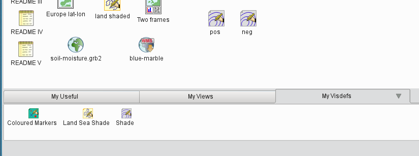
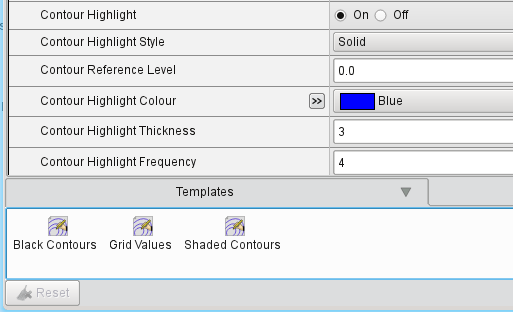

.. _optimising_your_workflow:

Optimising Your Workflow
########################

In this session we will look at the various ways in which you can streamline how you work with Metview so that you can perform common tasks as quickly as possible.

Icon Drawers
************

At the bottom of the Metview user interface is an area known as the *icon drawers*. 
This is a tabbed area where you can store icons which you will use often. 
Some sample drawers are supplied when you first start up Metview, but you can remove these and/or add your own. 
Have a look to confirm that the same set of icons is available in these drawers no matter which folder you are currently looking at in Metview.

To use the icons in the drawers, you can either:

* drag the icon from the drawer onto the desktop (a copy will be made)

* drag the icon from the drawer directly into the **Display Window**

Here are some suggestions of genuinely useful icons you can store here. 
In many cases, you will have already created such icons during other parts of the course, so you can just find them instead of creating them from scratch!

* in your current folder (not inside a drawer), create some *Geographic View* icons and set them up to view particular areas in your favourite projection. 
Drag and drop them into the *My Views* drawer (or create your own). 
Notice that the original icon remains in its folder - a copy of it has been made inside the drawer and they are not linked

* create some useful *Contouring* icons and drop them into the *My Visdefs* drawer (or create your own drawer). 
  Some suggestions:

  * shade from blue to red using 20 levels between the min and max of the data

  * plot grid points

* create or find some useful *Symbol Plotting* icons and drop them into the *My Visdefs* drawer (or create your own drawer)

* create or find a *Legend* icon which plots a vertical legend down the right-hand side of the page and drop it into the *My Visdefs* drawer (or create your own drawer)

Once you have some icons there, try plotting some data and using some of the icons in the drawers to enhance the plot.

Templates
*********

Templates are similar to the icon drawers, but work a little differently. 
Create a new *Contouring* icon and edit it. 
Set **Contour Shade** to On. 
Open the **Templates** tab at the bottom of the editor. 
This is a place where you can store icons (specifically Contouring icons since this is the *Contouring* editor). 
To see how they work, do the following:

* create another new *Contouring* icon, set it to have black isolines (**Contour Line Colour**) and call it *Black Contours*

* drop it into the *Templates* tab of the open icon editor

* close the icon editor, then re-open it to confirm that your dropped icon is still there; it is now available in the editor of any *Contouring* icon

* to *add* the parameters set in the template icon to the edited icon, drag the template icon into the main part of the editor - the **Contour Line Colour** parameter should now be black, but the **Contour Shade** setting should not have been lost

* to replace the parameters with the ones from the template, right-click on the template icon and choose **Replace Icon**; the **Contour Shade** setting is now Off because it was set to Off in the template icon

This mechanism provides a way to quickly build up new icons based on selected sets of parameters. For example, you could have template icons which activate shading with a nice palette, or which set the grid value plotting without replacing the other parameters in your icon.

Defaults
********

Each time you perform actions (e.g. visualising some data) in Metview, some defaults will be used if you have not specified otherwise. 
For example, if you plot some data on a map, a default *Coastlines* icon will be used. 
You can change these defaults. 
For example, if you always want land and sea shading, then you can set up such a *Coastlines* icon as your default.

To make a default icon, it must satisfy two criteria:

* it must be in your System/Defaults folder
* it must have the correct name, which is the name given when you create a new instance of it

Try the following:

* create a new *Coastlines* icon and don't change the name

* activate land and sea shading

* navigate to the Metview home directory in another tab or window (the home button in the navigation bar takes you there), then go into System/Defaults

* if there is a *Coastlines* icon already there, delete it

* copy your new Coastlines icon into System/Defaults

Now when you visualise some data, you will automatically have shaded land and sea! If you wish to remove land and sea shading for a particular plot (without changing the default) you will have to create a new, "empty", *Coastlines* icon and use this.
