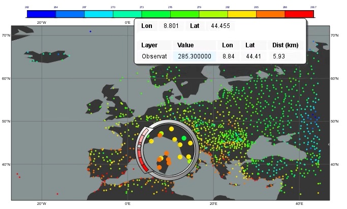

.. _part_3_bufr:

Part 3 - BUFR
#############

Full documentation on BUFR functionality in Metview is `here <https://confluence.ecmwf.int/display/METV/BUFR+Overview>`_; geopoints are documented here.
Full documentation on BUFR functionality in Metview is `here <https://confluence.ecmwf.int/display/METV/BUFR+Overview>`_; geopoints are documented `here <https://confluence.ecmwf.int/display/METV/Geopoints+Overview>`_.

Setup
*****

Navigate into the *3_bufr* folder within Metview.

Examine the BUFR file
*********************

Right-click and **examine** the supplied BUFR file obs.bufr, bringing up the BUFR Examiner tool.

.. image:: ../_static/metview_90_minute_introduction_part_3_bufr/mv-bufr-examiner3.png

Have a look around to see what's in the file, then find the key *airTemperatureAt2M* in the **Data Tree** tab. 
Right-click and **Copy item** to get this key name into the clipboard.

Filtering the BUFR file
***********************

We will now extract the 2m temperature values from the file. Create a new `Observation Filter <https://confluence.ecmwf.int/display/METV/Observation+Filter>`_ icon and edit it, setting the following parameters:

.. list-table::

  * - **Parameter**
    - **Value**
    - **Notes**

  * - **Data**
    - obs.bufr
    - Drop the obs.bufr icon into the editor box

  * - **Output**
    - Geopoints
    - 

  * - **Parameter**
    - airTemperatureAt2M
    - Can put ecCodes key names or numeric descriptors here

The editor should look like this:

Click OK, then **examine** the Obervation Filter icon. 
The filtering step will be executed automatically and the resulting `geopoints <https://confluence.ecmwf.int/display/METV/Geopoints+Overview>`_ data will appear in the examiner. 
You could also right-click on the icon and save the data, or drop the icon into a Python script file and add a ``write()`` command to write it to disk.

There are various possible output formats, but the standard geopoints output is a text file that looks like this:

Now **visualise** the result of the Observation Filter and drop the supplied icons `symbol_plotting <https://confluence.ecmwf.int/display/METV/Symbol+Plotting>`_ and coast_dark into the plot window.
Now visualise the result of the Observation Filter and drop the supplied icons `symbol_plotting <https://confluence.ecmwf.int/display/METV/Symbol+Plotting>`_ and `coast_dark <https://confluence.ecmwf.int/display/METV/Coastlines>`_ into the plot window.

Scriptify it
************

Filter, write and plot
======================

Create a new **Python Script** icon, edit it and drop the *Observation Filter* (and rename the variable to ``t2m``; also, absolute paths can be shortened to relative paths), *coast_dark* and *symbol_plotting* icons into the editor. 
Add the following commands to the end of the script and run it:

.. code-block::

  mv.plot(coast_dark, t2m, symbol_plotting)
  mv.write('obs_t2m.gpt', t2m)
  
Extract values and compute statistics
=====================================

Create a copy of the script, remove the plotting commands and add the following lines. 
The first two return numpy arrays, the third line returns a pandas dataframe.

.. code-block::

  print(mv.latitudes(t2m))
  print(mv.values(t2m))
  df = t2m.to_dataframe()
  print(df)
  print(df.describe())

If you have extra time...
*************************

Have a look in the solutions folder - there is a script called *field_values_at_gpts_locations.py*. 
This does several things, including using geopoints as a set of locations to extract values from a GRIB field, computing the differences between geopoints and GRIB fields, and plotting the differences to a PDF file.
