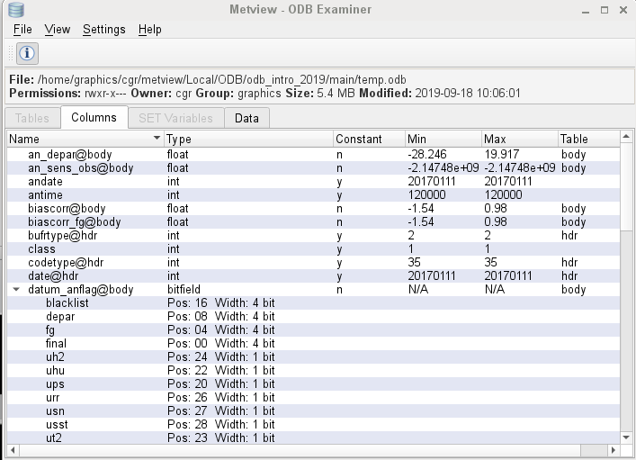
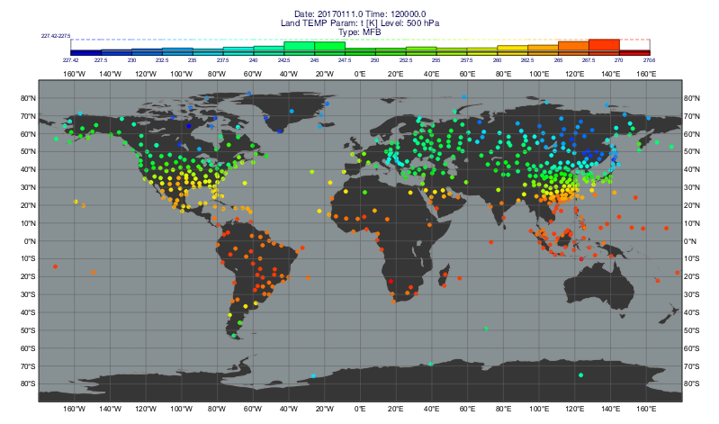
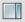
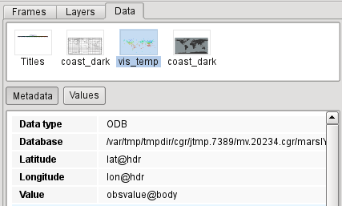
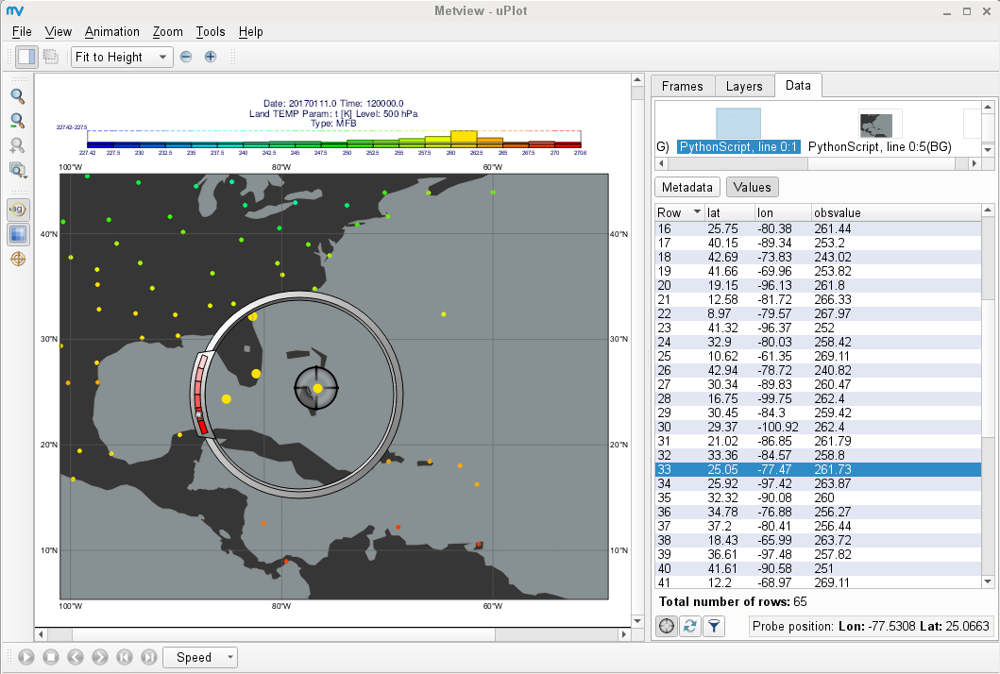

.. _part_4_odb:

Part 4 - ODB
############

Full documentation on ODB functionality in Metview is `here <https://confluence.ecmwf.int/display/METV/ODB+Overview>`_.

Setup
*****

Navigate into the *4_odb/main* folder within Metview.

Retrieving ODB data from MARS
*****************************

Use  the 'ret_temp' `MARS Retrieval <https://confluence.ecmwf.int/display/METV/MARS+Retrieval>`_  icon to fetch Land TEMP ODB data from MARS for a given date. 
Edit the icon (right-click & **edit**) to see what parameters are set. 
The most important ones are as follows:

.. list-table::

  * - **Parameter**
    - **Value**
    - **Description**

  * - **Type**
    - MFB
    - Mondb feedback

  * - **Obsgroup**
    - 17
    - Conventional

  * - **Reportype**
    - 16022
    - Land TEMP

Close the icon editor and perform the data retrieval by choosing **execute** from the icon's context menu. 
The icon name should turn orange whilst the retrieval takes place, then green to indicate success.

If 'ret_temp' does not turn green after half a minute probably there is a problem with MARS. 
In this case find the 'backup.temp.odb' *ODB Database* icon at the top-right of the folder and rename it 'temp.odb' (**right-click** and **rename**). 
This icon contains the very same data that we wanted to retrieve from MARS.

If the MARS retrieval was successful the data is now cached locally. 
To save the ODB data from the cache to disk, right-click **Save result** on the *Mars Retrieval* icon and save as 'temp.odb'. 
A few seconds later an *ODB Database* icon with the given name will appear at the bottom of your folder.

Examine the ODB file
********************

To see what was retrieved, right-click **examine** the icon. 
This brings up Metview's **ODB Examiner** tool.

Here you can see the metadata (**Columns** tab) and the actual data values themselves as well (**Data** tab).
Close the ODB Examiner.

Interactive Visualisation
*************************

Using the ODB Visualiser
========================

We will visualise the 500 hPa temperature values from our ODB by editing the supplied 'vis_temp' `ODB Visualiser <https://confluence.ecmwf.int/display/METV/ODB+Visualiser>`_ icon. 
The ODB/SQL query we need to perform is as follows:

.. code-block::

  select
    lat@hdr,
    lon@hd,
    obsvalue@body
  where
    varno = 2 and vertco_reference_1=50000

Now edit the 'vis_temp' icon and set the following parameters:

.. list-table::

  * - **Odb Data**
    - Drop the temp.odb icon into this box

  * - **Odb Where**
    - varno = 2 and vertco_reference_1=50000

Save the icon and visualise it. Then drag the the provided `Symbol Plotting <https://confluence.ecmwf.int/display/METV/Symbol+Plotting>`_, `Coastlines <https://confluence.ecmwf.int/display/METV/Coastlines>`_, `Legend <https://confluence.ecmwf.int/display/METV/Legend>`_ and `Text Plotting <https://confluence.ecmwf.int/display/METV/Text+Plotting>`_ icons into the plot for further customisation (either one at a time, or all together). Keep the plot window open.

Inspecting the Data Values in the Plot
======================================

The data values can  be inspected with the **Cursor Data Tool** (you can combine it with the **Magnifier** to see the fine details).
Enable the sidebar of the Display Window with the 

button and select the **Data** tab (and select the 'vis_temp' layer at the top if it is not yet selected). 
Now select the **Metadata** panel inside the tab. 
Here you will find some statistics about the data plotted and a histogram as well.

Now switch to the **Values** panel. 
This features a list showing all the plotted data.  
In the bottom-left corner click on the

button to activate the **Data probe** (this will appear in the plot). 
The probe is synchronised with the list. 
Try to drag it around in the plot, or change its position through the list. 
The **Magnifier** might help you position the **Data probe** more accurately.

Python Examples
***************

There are a few Python examples in the folder for you to study. 
Open and run these scripts.

.. list-table::

  * - plot_map.py
    - .. image:: ../_static/metview_90_minute_introduction_part_4_odb/image2019-9-18_10-18-22.png
  
  * -
    - This is the Python code to generate the same plot as we did interactively
    
      above. The title and the symbol plotting value range are automatically
      
      computed from the actual data values. In the script we:
      
      * used **odb_visualiser()** to generate the plot

      * called **odb_filter()** (see `ODB Filter   
        <https://confluence.ecmwf.int/display/METV/ODB+Filter>`_) to extract additional
	data for the title
    
      * used the **values()** function to access a given ODB column as a **numpy** array.
	
  * - plot_diff.py
    - .. image:: ../_static/metview_90_minute_introduction_part_4_odb/image2019-9-18_10-14-9.png
    
  * - 
    - This script computes the difference between the forecast fields stored in 
    
      'fc.grib' and our ODB observations. This is achieved by using the following      
      steps:

      1. the ODB query is performed and the resulting data is converted into      
         Geopoints

      2. the matching GRIB field is read and interpolated to the observation 
         points

      3. the difference is computed between forecast and observation	
	
  * - to_pandas.py
    - .. image:: ../_static/metview_90_minute_introduction_part_4_odb/image2019-9-18_10-15-52.png
	
  * - 
    - This script shows how to convert an ODB into a **Pandas dataframe** with the 
      **to_dataframe()** function.

  * - plot_wind.py
    - .. image:: ../_static/metview_90_minute_introduction_part_4_odb/image2019-9-18_10-14-46.png

  * - 
    - This script shows how to plot wind data from ODB.

If you have extra time...
*************************

There are some other examples provided in the '4_odb' folder (it is one level up from folder 'main').

Satellite radiances
===================

Enter folder 'radiance_map'.

"ASMUA.odb" stores AMSU-A brightness temperature observations. Use 'tb_plot' to visualise it and the other provided icons to customise the plot.

Scatterometer wind
==================

Enter folder 'scatterometer'.

'SCATT.odb' contains scatterometer data. The script 'scatt,py' extracts and plots scatterometer wind (ambiguous wind components) for a limited area and time period. Visualise the Python script and drop the provided 'mslp.grib' icon into the plot. This GRIB contains a mean sea level forecast valid at the same time as the observations. 

Scatterplot
===========

Enter folder 'scatterplot'.

"ASMUA.odb" stores AMSU-A brightness temperature observations.

Visualise 'scatter_plot' and customise it with the provided `Symbol Plotting <https://confluence.ecmwf.int/display/METV/Symbol+Plotting>`_ icon. 
The plot you see is a scatterplot for the first guess departures (x axis) and analysis departures (y axis) for a given channel.

Visualise 'bin_plot' to get the binned version of the same data (as a heat map). Drop the provided  `Contouring <https://confluence.ecmwf.int/display/METV/Contouring>`_, `Cartesian View <https://confluence.ecmwf.int/display/METV/Cartesian+View>`_ and  `Text Plotting <https://confluence.ecmwf.int/display/METV/Text+Plotting>`_ icons into the plot to fully customise it.

Wind profiler
=============

Enter folder 'wind_profiler'.

'PROF.odb' contains wind profiler data. Use 'profiler.mv' to plot this data into a time-height diagram for a selected station.
