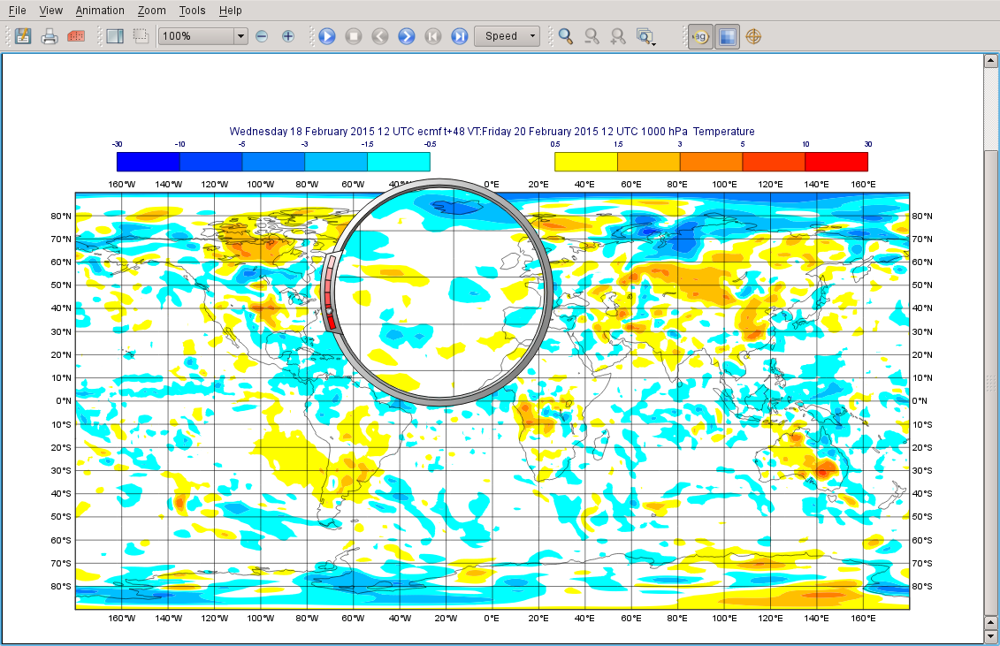
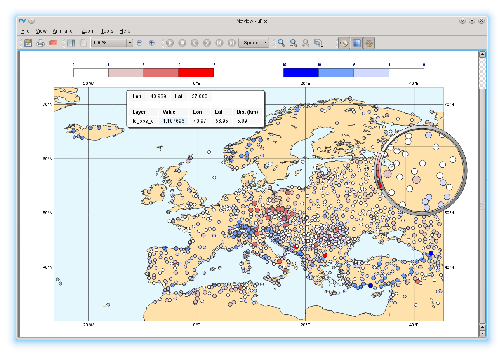
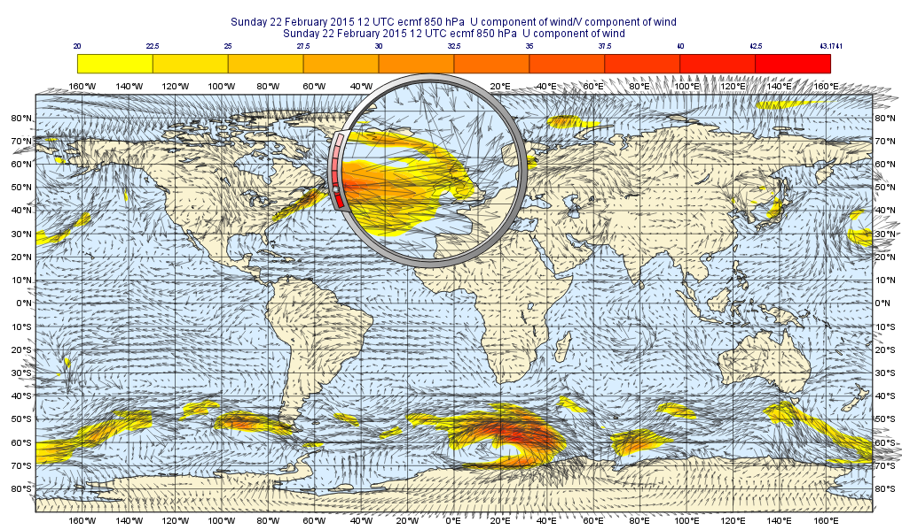
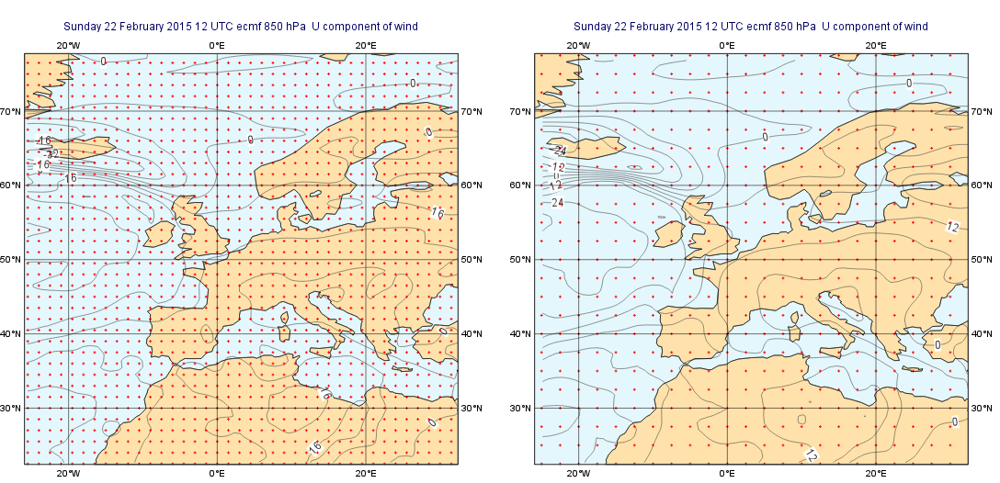
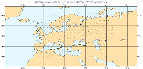
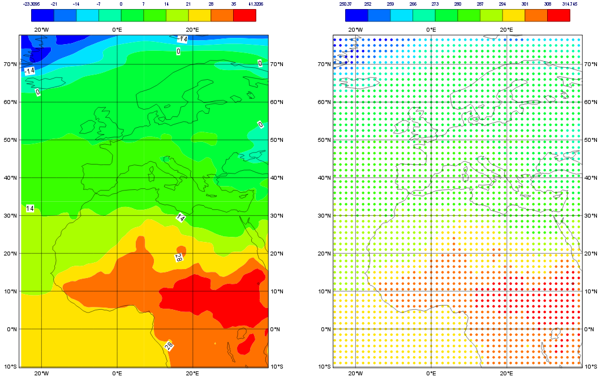

.. _processing_data:

Processing Data
###############

**Download**

.. list-table::

  * - **File**
    - Modified

  * - File `processing data.tar.gz <https://confluence.ecmwf.int/download/attachments/45753989/processing data.tar.gz?api=v2>`_ 
    - Mar 19, 2015 by `Iain Russell <https://confluence.ecmwf.int/display/~cgi>`_

  * - File `ztuv.grb <https://confluence.ecmwf.int/download/attachments/45753989/ztuv.grb?api=v2>`_
    - Mar 23, 2015 by `Iain Russell <https://confluence.ecmwf.int/display/~cgi>`_

Overview
********

One of Metview's most powerful features is its data processing ability. Data from various sources can be combined and manipulated using high- or low-level commands.

Fieldset Manipulation
=====================

A *fieldset* is a collection of fields stored physically in GRIB files. Metview has many built-in `functions and operators <https://confluence.ecmwf.int/display/METV/Fieldset+Functions>`_ to manipulate fieldsets, from simple arithmetic operators to vertical integrations through the atmosphere. Many of these operations are available from the icon-based user interface, all are available in the Macro language. The results can be stored on disk, or passed to other functions for further manipulation.

Most of these functions work on each gridpoint value of each field in the fieldset. For example, if we add 1 to a fieldset which contains 3 fields, this will return a new fieldset with 3 fields, the values of whose gridpoints are 1 greater than those in their respective input fields, as shown below:

[FIELDSET ILLUSTRATION]

The situation is similar for operations between two fieldsets:

[FIELDSET ILLUSTRATION]

This example also illustrates what happens when *missing values* are in the data, represented here by an "x". 
In most cases it is not valid to use the missing value in the result, so that point in the result will itself be set to the missing value indicator.

The meta-data in a resulting field is taken from the first field in the computation.

Computing a Forecast - Analysis Difference
******************************************

As a simple example, let's compute the difference between a set of forecast fields and the corresponding set of analysis fields for the same time step.

Examine the supplied GRIB files to confirm that *temperature_forecast.grib* contains, at multiple vertical levels, 48-hour temperature forecasts for the same date and time as the analysis data in *temperature_analysis.grib*.

Create a new *Simple Formula* icon and rename it to *fc_an_diff*. 
Edit the icon, ensure that the first **Formula** type is selected (F+G) and that the operator is minus ( - ). 
Drop your *temperature_forecast.grib* icon into the **Parameter 1** box, and drop *temperature_analysis.grib* into the **Parameter 2** box. 
Save the icon and **execute** it. 
The icon should turn green, indicating the result has been computed and cached. 
Further operations on this icon will not re-compute the result unless either of its input icons are modified. 
If you simply wanted the result to be stored, you could right-click and choose **save result** to bring up a file save dialogue; but instead choose **visualise** to plot it. 
Note that all 6 fields in each data icon are used in the computation - the result is a set of 6 fields.

Two `Contouring <https://confluence.ecmwf.int/display/METV/Contouring>`_ icons are supplied, which can be used to show the differences. 
Drop *pos_shade* and then *neg_shade* into the **Display Window**. 
Notice that the second one replaces the first one - this is not what we want! 
Select both icons with the mouse and drop them both together into the **Display Window** to use them both in the plot. 
Edit the icons to see which parameters were used to create the positive and negative shading effects. 
There is also a *Contouring* icon called *rainbow_diffs* - this uses Metview's ability to draw isolines of different colours rather than using shading. 
This can be useful if it is important to see another layer underneath the temperature.

We could have done this a bit quicker - there was no need to **execute** the *fc_an_diff* icon. 
Clear the cache by right-clicking the icon and choosing **clear result**. 
Now directly **visualise** the icon - the **execute** action is performed in the background, as it is required before visualisation can occur.

Putting it into a Macro
=======================

Ensure that the difference fieldset is visualised with a contouring applied. 
One way to generate a Metview Macro script from this plot is to click the **Generate Macro** button (also available from the **File** menu). 
A new Macro script will be generated - have a look at it to confirm that it contains code to read the data, compute the difference and plot the result. 
Run the macro to obtain the plot, either by using the **Run** button from the Macro Editor, or by selecting **visualise** from the icon's context menu). 
By default, the macro is written so that it will produce an interactive plot window; it will generate a PostScript file if it is run with the **execute** command, or if it is run from the command line.

Have a look at the generated macro code. With a little cleanup, the code to read the GRIB files and compute their difference is just this:

.. code-block::

  temperature_forecast = read("temperature_forecast.grib")
  temperature_analysis = read("temperature_analysis.grib")
 
  fc_an_diff = temperature_forecast - temperature_analysis

The variables ``temperature_forecast`` and ``temperature_analysis`` are of type *fieldset*, which is Metview Macro's own data type for storing fields. You can confirm this, and print the number of fields with these lines of code:

.. code-block::

  print(type(temperature_forecast))
  print(count(temperature_forecast))

Metview Macro has a large set of `functions and operators on fieldsets <https://confluence.ecmwf.int/display/METV/Fieldset+Functions>`_.

Computing a Forecast - Observation Difference
*********************************************

This time we'll compare two very different data types: gridded forecast data in a GRIB file, with scattered observation data described in a BUFR file. 
We will use the *t2m_forecast.grib* icon (the gridded forecast data), and the observation data is in a BUFR file represented by the *obs.bufr* icon and contains observations over Europe, valid at the same time as the GRIB data. Examine and visualise both icons to confirm what they contain.

Extracting the 2 metre temperature
==================================

The first step to comparing GRIB data with BUFR data is to extract just the parameter we want from the BUFR data and convert it to the `geopoints <https://confluence.ecmwf.int/display/METV/Geopoints>`_ format. 
Then the computation will be simple.

Create a new *Observation Filter* icon and rename it to *filter_obs_t2m*, setting these parameters:

.. list-table::

  * - **Data**
    - Drop the obs.bufr icon here

  * - **Output**
    - Geographical Points

  * - **Parameter**
    - 012004

Note that 012004 is the code for 'Dry bulb temperature at 2m'. 
Confirm that the result of this icon's filtering is a set of geopoints with temperature values.

Computing the forecast-observation difference
=============================================

This is just the same as before, using a *Simple Formula* icon; create a new one and rename it to *fc_obs_diff*. 
Drop *t2m_forecast.grib* into the **Parameter 1** box, and *filter_obs_t2m* into the **Parameter 2** box. 
Notice how we are chaining together a sequence of icons - the output of the *Observation Filter* icon is an input to the *Simple Formula* icon. 
Any number of icons can be chained together like this.

Visualise the result - you will see that the result of a field minus a scattered geopoints data set is another geopoints data set. For each geopoint location, the interpolated value from the field was extracted before performing the computation. 
From the solutions folder, drop both the *diff_symb_hot* and the *diff_symb_cold* icons together into the plot in order to get a more graphical representation of the result.

Putting it into a Macro
=======================

As with the previous exercise, create a macro which will run all of these steps and plot the result.

Computing Wind Speed from U/V
*****************************

The GRIB file *uv850.grib* contains forecast data for U and V wind components at 850hPa at various forecast steps (visualise it to confirm). 
The task is to compute the wind speed from this using a macro, so create a new *Macro* icon, rename it *compute_wind_speed* and edit it.

Perform the following steps:

1. filter the U wind component into a variable called ``u`` (you may find it useful to use the *GRIB Filter* icon to do this and then drop it into the Macro Editor)

2. filter the V wind component into a variable called ``v``

3. apply the formula ``speed = sqrt(u*u + v*v)``

4. plot the result

You may wish to apply the following enhancements to the plot:

1. apply some shading to the data with a `Contouring <https://confluence.ecmwf.int/display/METV/Contouring>`_ icon, only contouring wind speeds above 20m/s

   a. note that we use `Wind Plotting <https://confluence.ecmwf.int/display/METV/Wind+Plotting>`_ icons to modify the plotting of vector fields, but this is now a scalar field, so we use the *Contouring* icon

2. overlay the original wind field and change the colour of the arrows to 'charcoal' with a *Wind Plotting* icon

3. shade the land and the sea with a `Coastlines <https://confluence.ecmwf.int/display/METV/Coastlines>`_  icon

Returning the Result of a Computation for Further Interactive Use
=================================================================

The result of the above macro does not have to live entirely inside the macro - it can be passed back to the user interface or used as input to other icons. 
Do this:

1. in the above macro, comment out the ``plot()`` command (using the hash, #, symbol)

2. add a new line of code at the end:
   
   ``return speed``

This passes the fieldset ``speed`` back to the user interface. 
Try it by right-clicking on the macro's icon and selecting **examine*, **save** or **visualise**. 
This icon can also be dropped into an existing **Display Window** to plot the data there. 
It could also be used as an input to another icon, for example a *Simple Formula* icon, for further processing.

Writing the result of a computation to disk
===========================================

Again, modify the last line of the *compute_wind_speed* icon so that we now instead write the result to a file:

.. code-block::

  write('wind_speed.grib', speed)

A full path could also have been supplied if you do not wish the file to be written to the current directory.

Field Interpolation and Sub-area Extraction
*******************************************

Metview's *GRIB Filter* icon has parameters which enable the interpolation of data onto a new grid, or the extraction of a sub-area of data. 
This can be useful if you wish to compare two fields which are currently at different resolutions (e.g. from different model runs) - both fields need to be on the same grid before Metview can perform computations between them.

Field Interpolation
===================

Visualise the U wind field (via the *GRIB Filter* icon you created earlier) and apply the supplied *gridpoints* icon to display the locations of the grid points - they are on a regular 1.5 degree grid.

Now create a new *GRIB Filter* icon with these parameters:

.. list-table::

  * - **Data**
    - Drop the uv850.grib icon here

  * - **Param**
    - U

  * - **Grid**
    - 2.5/2.5

The result will be the same data interpolated onto a 2.5x2.5 degree grid. 
Visualise the result and apply the supplied *gridpoints* icon to confirm the new grid. 
Visualise the two fields side-by-side with coloured contour shading to also confirm that they look very similar in terms of their data values.

Sub-area Extraction from a Fieldset
===================================

The *GRIB Filter* icon also allows the extraction of a sub-area from a fieldset. 
Create a new one and, using the **Area** parameter, extract just the data over a region for any of the supplied GRIB files. 
The area is defined as a list of 4 numbers, forward slash-delimited, representing its North/West/South/East bounds.

Conversion Between Fields and Points
************************************

Metview provides two icons, `Geopoints To Grib <https://confluence.ecmwf.int/display/METV/Geopoints+To+Grib>`_ and `Grib To Geopoints <https://confluence.ecmwf.int/display/METV/Grib+To+Geopoints>`_ for the purpose of converting between GRIB (gridded) and geopoints (scattered) formats.

Use a *GRIB to Geopoints* icon to convert the GRIB file *temperature_analysis.grib* to geopoints format. 
**Examine** the result to confirm that it is now geopoints and that we have a list of all the individual points. You can also visualise it, applying the supplied *symb_colours* icon. 
Converting to geopoints format is an easy way to export the data in an ASCII format.

Use a *Geopoints to GRIB* icon to convert the geopoints result of the *fc_obs_diff* icon to GRIB. 
We now have gridded data derived from scattered points. 
This icon contains some parameters to help define the output grid and the interpolation process used in the conversion; it is also possible to supply a template GRIB file which will be used to define the output grid.

Extra Tasks
***********

Computing statistics fields
===========================
Your forecast-analysis difference macro works on fieldsets containing 6 fields (6 different vertical levels in the atmosphere), so the result also contains 6 fields. Instead of plotting all 6 fields, compute fields which represent the minimum, maximum and means of these fields. 
For example, if we have 6 fields in fieldset variable ``fs``, then the following code computes a single field, the values of which are the minimums across all 6 input fields:

.. code-block::

  min_field = min(fs)

Plot the results and cross-reference with the original result of 6 fields to confirm that you understand what has been computed.

Extract field values at a set of locations
==========================================

Extract the temperature values from the *t2m_forecast.grib* file at all the locations in the geopoints data returned by the *filter_obs_t2m icon*. 
Hint:

* the Macro function ``interpolate(field, geopoints)`` returns a new geopoints variable whose locations are from its input geopoints and whose values are interpolated from the input field

Extracting point values
=======================

There are many ways to extract the value of a field at a given point or set of points. 
Try this one - call ``nearest_gridpoint_info ( fieldset,number,number )`` with the latitude and longitude of a geographical location and print the result to see which data gridpoint is closest to it.

Automatic conversion between grids
==================================
Write some macro code which automatically converts *t2m_forecast.grib* to use the same grid as the first field in *uv850.grib*. 
Hints:

* read both files
* use the ``grib_get_double(fieldset, string)`` function twice to extract the grid resolution from the first field in ``uv850 (uv850[1])``
  
  * use the Grib Examiner to find which GRIB_API keys define these parameters

* use the ``read()`` command to set the grid on the temperature field
