.. _the_scm_interface_in_metview_tutorial:

The SCM Interface in Metview Tutorial
#####################################

Introduction to using the Single Column Model interface in Metview
******************************************************************

What does Metview offer for SCM users?

In Metview users can:

* examine and edit (modify) an input netCDF file

* define a namelist file for SCM

* run SCM using a given executable, input netCDF file and namelist

* having run SCM Metview concatenates the three output netCDF files into one netCDF file. 
  Users can specify the name and location of this file

* run a Metview macro which offers different ways to visualise the output data and compare runs.

In the following chapters we give details about the icons that make up the Metview SCM interface and also show how to use them.

Preparation
***********

Start Metview
=============

To access the SCM interface metview_new has to be used. 
It can be started up by typing

.. code-block:: python

  metview &
 
on the command line.

Copy the tutorial files
=======================

From a command line, type  
  
.. code-block:: python
  
  /home/ectrain/trx/pa/scm_setup

From your main Metview desktop, you should now see a number of folders including one called *SCM_tutorial* - double-click to open it. 
It should contain two icons, and a folder with solutions like this:

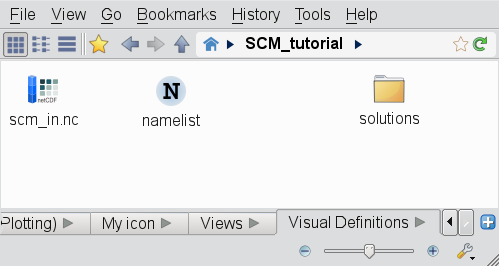

The SCM Input Data icon
***********************

Your input SCM data file (scm_in.nc) is recognised as a distinct filetype in Metview and this icon is assigned to it:

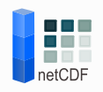

Right-click this icon and select **examine** from the context menu. 
Metview's own **netCDF examiner** is started up showing the metadata content of the file.

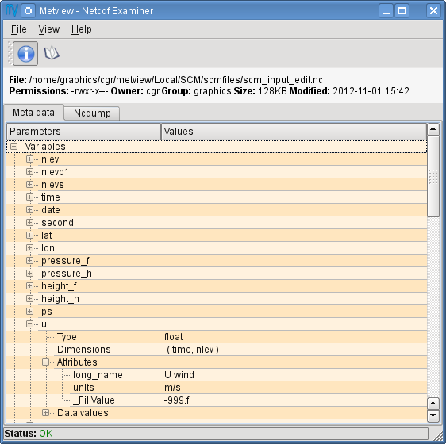

Now close the netCDF examiner.

We will create a copy of this data and edit it. 
Right-click the icon and select **duplicate** from the menu. Rename the copy *scm_in_modified.nc* by clicking on the icon name. 
Right-click this new icon and select **edit** from the menu. 
The **Metview profile data editor** pops up.

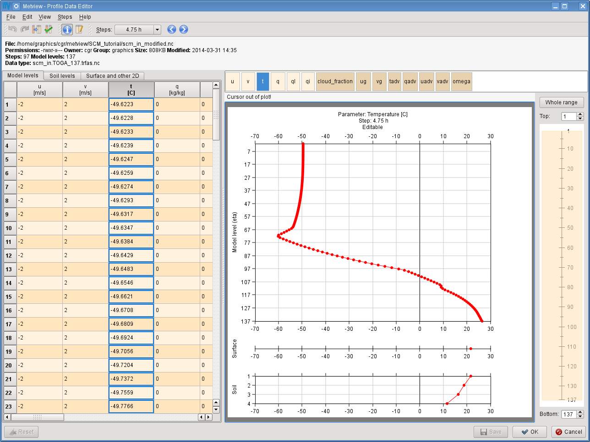

This bespoke editor allows examining and modifying the data stored in the file.

The editor's window is split into three parts:

* the top side features a **file information panel**

* the left hand side shows the data in a **table view** (each column represents a given profile)

* the right hand side displays the selected **profile as a curve**. 
  There is a level range selector to the right of the curve plot. 
  By dragging or resizing the orange rectangle the actual level range can be set arbitrarily.

.. note::

  **Hiding the file information panel**
  
  On smaller screens the file information panel may occupy too much space and thus reduces the visible data/plot area. 
  You can easily hide (or shown again) by using this toolbar icon:
    
  [missing image]
    
Profile selection
=================

Profiles can be selected in various ways:

* by clicking into table cell

* by clicking on a table header

* by clicking into the parameter list located above the profile plot (see the snapshot below).

[missing image]

This list only contains the model level parameters and their colour code indicate whether they are editable (light beige) or not (dark beige). 
Use this button 

[missing image]

in the toolbar to show only the editable parameters.

**Select the temperature profile - we will edit it in the next step**.

Parameter editing
=================

All the surface and soil parameters and a set of model-level variables are defined to be **editable** and their columns are highlighted in a brighter shade of beige.

Editing can be done by typing a new value in a table cell or by dragging the points of the curve. 
These actions are synchronised: any modification in the table view will be immediately reflected in the curve, and vice versa. 
Modified data values are highlighted in deep orange.

**Now change some values in the temperature profile to see how editing works.** 
Try both the table-based and graphical editing.

[missing image]

The **redo/undo** functionality works for all individual editing steps. 
You can access it via these toolbar buttons

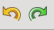

or by the Ctrl+Z (undo) Ctrl+Shift+Z (redo) keyboard shortcuts.

If you would like to reject all your changes and go back to the last saved state just click on the **Reset** button in the bottom left corner of the editor window.

[missing image]

.. note::

  **Saving edited data**

  Please note that no changes are saved back into the edited file until you click **Save** or **Ok** (this performs save and closes the editor) in the bottom right corner of the editor window. 
  There is another button here: **Cancel**, which closes the editor and rejects all the unsaved modifications.

  [missing image]

Time stepping
=============

You can easily navigate through the timesteps either by using the step **combo box** in the toolbar or the **previous/next buttons** next to it.

[missing image]

The step comb box indicates if a timestep was edited: for such steps a small "edited" icon appears next to the step label. 

[missing image]

Overwriting time steps
======================

What you have edited so far was one timestep (0h) only. 
Now you will learn how to overwrite the other timesteps with the data in the current one. 
First, ensure that you selected your modified timestep.  
Second, click this button in the toolbar:

[missing image]

You will see a dialog popping up asking you to confirm the changes. Please note that after this operation the redo/undo history gets deleted!

Finish editing
==============

Having finished the modifications the data can be saved back to the netCDF file by clicking on the **Ok** button.

Namelists
*********

Your namelist file is recognised as a distinct filetype in Metview and this icon is assigned to it:

Double-click or right-click **edit** the namelist to see or change its content using Metview's own text editor. 
We will not make any changes to the namelist in this tutorial, so close the editor.

The SCM Run Icon
****************

You can run the SCM in Metview by using the *SCM Run* icon:

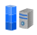

To create a new *SCM run* icon, right-click in the Metview desktop and select 'Create new icon'. 
This will bring up the Create new icon dialogue.  
In the dialogue just type "scm" into the **Filter** field then click on the *SCM Run* icon in the icon list and wait until the newly created icon appears in your folder.)

The  most important parameters you might need to edit in the *SCM run* icon are as follows:

* define the path to the SCM **executable** (relative paths are allowed)

* define the **namelist** for the SCM run

* define the way the **output** data is treated. 
  The output is always a netCDF. 
  By default this is cached in a temporary directory, but it can be saved to a given path.

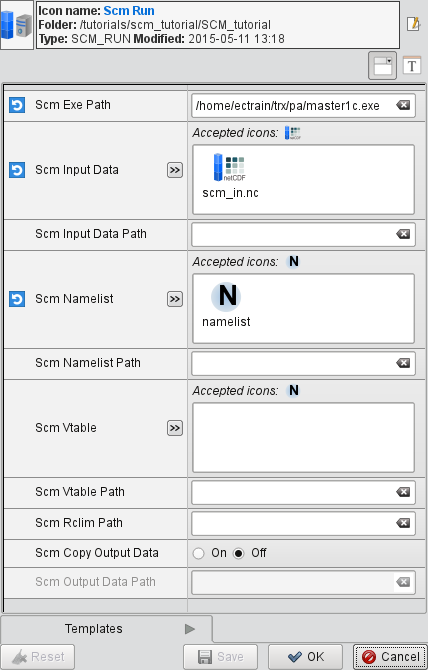

Now double-click or right-click **edit** your *SCM Run* icon to open up its editor.

First, specify the path to your SCM executable via parameter **SCM_EXE_PATH**. 
If you do not have one available, you can use the one which was used in creating this tutorial: ``/home/ectrain/trx/pa/master1c.exe``.

Second, drop your original unmodified input data icon (*scm_in.nc*) into the **SCM_INPUT_DATA_PATH** field and your namelist into the **SCM_NAMELIST** fields, respectively.

Finally, save your changes (by clicking **Save** in the editor) then right click and **execute** the icon to start your SCM integration. 
The icon label turns **orange** indicating that the computations have started. 
Having finished the integration the icon label turns **green** showing that no errors occurred (on error the icon label turns **red**).

If any errors or warning were generated these will be available in the icon's output log, available through the **Log** entry in the icon's context menu. 
This window always shows the location of the **STDOUT** and the **fort.20** file generated during the SCM run.

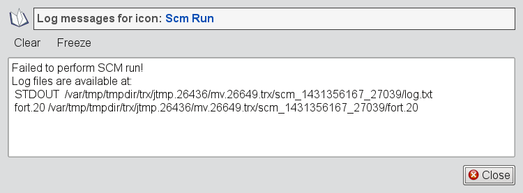

Now duplicate your *Scm Run* icon and rename the copy *Scm Run 2*. 
Edit the new icon, right-click **remove** the **Scm Input Data**, then drop your modified input data icon (*scm_in_modified.nc*) into the **Scm Input Data** box in the editor. 
Save your changes, then **execute** this icon. 
You have now run the single column model on two different sets of input data, and the results are cached.

Visualising the SCM data
************************

The output of an SCM run can be visualised using the *SCM Visualiser* icon, available from the right-click 'Create new icon' desktop menu:

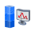

This icon allows the generation of the following plot types (specified in the **Scm Plot Type** parameter) :

**Time Height Matrix**

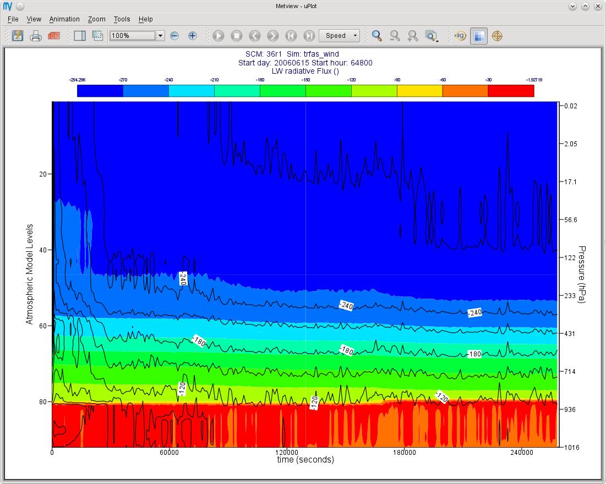

**Time Value Curve**

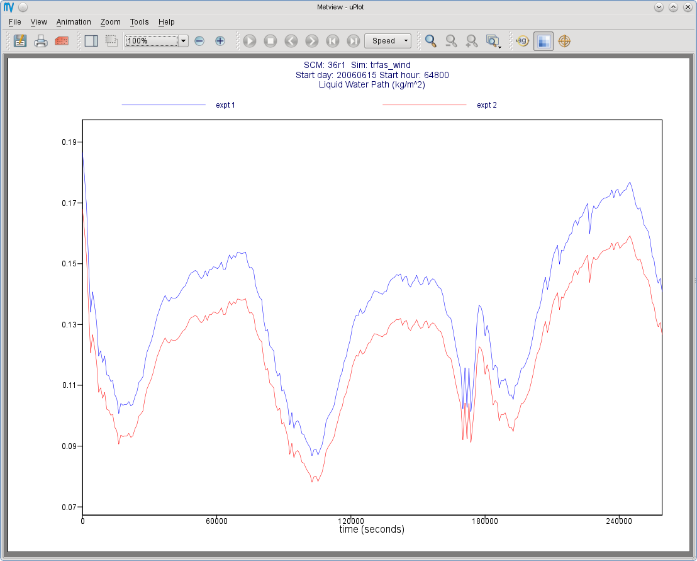

**Profile**

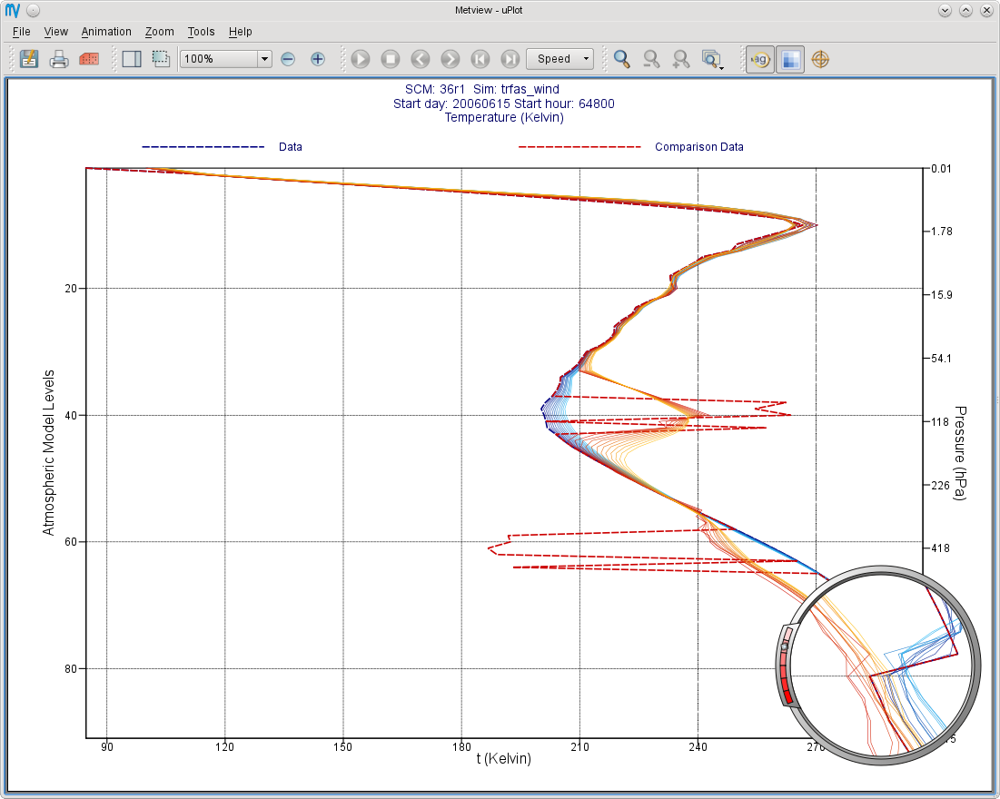

Visualising a parameter as a time/value curve
=============================================

Create a new *SCM Visualiser* icon and edit it. Drop your *SCM Run* icon into the **Scm Data** parameter box in the *SCM Visualiser* icon editor.

.. note::

  The *SCM Run* icon is acting as a *proxy* for the result data that it generated (and has been cached within this Metview session); if you had asked for a copy of the output data to be generated, then that icon could have been used as input to the visualiser.
  
Set the following parameters:

.. list-table::

  * - **Scm Plot Type**
    - Time Value Curve
    
  * - **Scm Output 1d Variables**
    - Liquid Water Path
    
Make sure that only your desired variable is selected - you will have to de-select *t_skin*. 
Save the icon and right-click Visualise it to get an on-screen plot.

Comparing the outputs of two SCM runs
=====================================

To compare your two runs, set **Scm Compare Data** to **On** and drop your *SCM Run 2* icon into the **Scm Comparison Data** icon box. Apply, then visualise.

Other visualisation types
=========================

To generate a different plot, but keep these settings, make a copy of your *Scm Visualiser* icon and edit this copy.

.. note::

  These icons basically store a collection of settings, and can be pre-defined and distributed to other users.

Try the following settings to obtain a **matrix plot**:

.. list-table::

  * - **Scm Plot Type**
    - Time Height Matrix
    
  * - **Scm Output 2d Variables**
    - Lw Radiative Flux

If comparing two SCM runs, the first will be represented with coloured shading, whilst the second will be drawn with isolines only.

To obtain a set of **profiles**, try these settings:

.. list-table::

  * - **Scm Plot Type**
    - Profile
    
  * - **Scm Output 2d Variables**
    - Temperature
    
The **Profile** option produces a set of curves, with the intensity of the line colour representing the time step (the most intense, and dashed, line is time zero; the profiles become more faded as they go further into the future). 
The **Scm Times** parameter specifies the time slices to use (specified in minutes).

Plotting the difference between two SCM runs
============================================

The other way of visualising the differences between two runs is to set **Scm Comparison Mode** to **Difference**. In this mode, Metview will not overlay the data, but will compute the differences between the two runs and plot these differences in the desired **Scm Plot Type**.

Additional information about plotting
=====================================

.. note::

* For all plot types, it is possible to select multiple variables, but in this case, **Scm Output Mode** must be set to Postscript. 
  This limitation should be lifted in the future.
  
* The *Scm Visualiser* also contains parameters which can be used to change the x and y axis limits, and also to set the limits on the value range considered for shading in the matrix plots. 
  An axis grid can also be enabled.
  
* The *Scm Visualiser* can also be used to plot the SCM input netCDF files - set **Scm Data Type** to **Input**; the parameters **Scm Input 1d Variables** and **Scm Input 2d Variables** become available.
