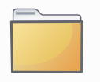
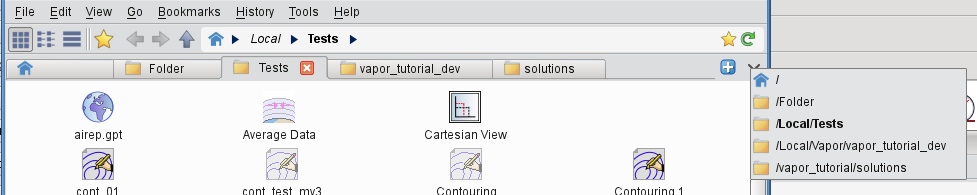
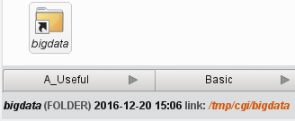
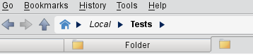
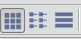
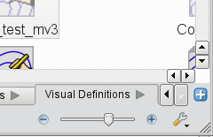
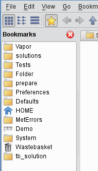
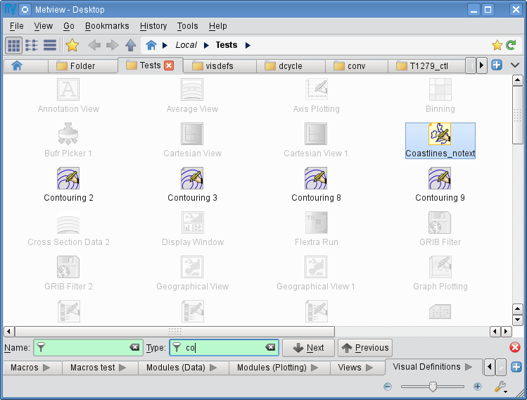
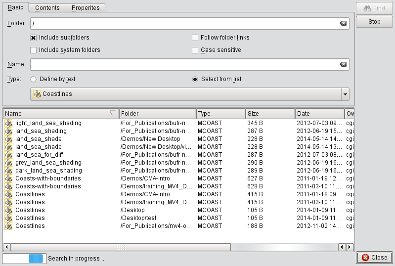

.. _working_with_folders_and_icons:

Working with Folders and Icons
##############################

Working with folders
********************

Folders are represented by this icon in the user interface:

To enter a folder double-click, hit enter or right-click **Open** on the icon. 
Folders can also be opened in a **new tab or window** by using the context menu of the *Folder* icon.

The central part of Desktop can contain **multiple tabs**, each showing a different folder. 
`Folder navigation <https://confluence.ecmwf.int/display/METV/Metview%27s+user+interface>`_ works for each tab independently.

New tabs can be added by the blue button at the right edge of the tab bar or by using the **Ctrl+T** keyboard shourtcut.

There is a drop-down menu available at the right edge of the tab bar showing the actual list of open tabs. 
This menu can significantly ease the tab navigation if there is a large number of tabs open in a given Desktop window.

Reaching folders and files outside the Metview folder hierarchy
===============================================================

Metview's "home" folder is ``$HOME/metview`` (unless changed by using the ``-u`` command-line start-up option). 
To reach files outside of this folder and its sub-folders, you must create *links* to those files. 
Do this by right-clicking on an empty part of the Metview desktop and select **Create New... Link to File** or **Create New... Link to Folder**. 
The link will appear with italicised text. 
When the mouse cursor hovers over the link icon, the status bar shows the path to the real file or folder.

Folder navigation
=================

Folder navigation is based on the **Back**, **Forward** and **Up** arrows and on the **breadcrumbs**, which are all located in the toolbar. 
The **breadcrumbs** consist of the Home icon and the folder hierarchy to the right of it, including the arrows in-between them.

Each visited folder is added to the folder history, which can be accessed via the **History** menu.
Both breadcrumbs and history items have a context menu, which allows opening the folders in a **new tab or window**.

Folder view properties
======================

View modes
----------

There are three folder view modes available:

* **Classic icon view**: icons are freely movable and icon labels are rendered **below** the icon pixmaps

* **Simple icon view**: icons are freely movable and icon labels are rendered to the **right** of the icon pixmaps

* **Detailed view mode**: icons and their properties are displayed in a table format with sortable columns

The view modes can be set for each tab separately through the **View** menu or by using these toolbar icons:

Changing icon sizes
-------------------

The status bar features an icon size slider to change the icon sizes in the current folder (sizes between 16 and 96 pixels are available).

Bookmarks
=========

Both folders and tab-sets can be bookmarked. 
Bookmarks can be accessed either via the **bookmarks menu** or the **bookmarks sidebar**.

There are various ways to bookmark a folder. It can be done with:

* the **Bookmarks** menu

* the context menu of a Folder icon, folder tab or breadcrumbs item

* the context menu of the **Bookmarks** sidebar

* the bookmarks icon at the right hand edge of the navigation bar

Finding icons
*************

Metview's folders can become cluttered with icons. 
Usually it is best to put related icons into well-organised sub-folders, but not everyone works like this!

Fortunately, Metview provides some ways to find the icon you're looking for.

Icon filtering
==============

Metview features a filtering facility for finding icons in cluttered desktops. 
Just press **Crtl+F** in any of the folder views to bring up the icon filter bar at the bottom of the folder view.  
By typing in a filter term for **name** or/and **type** the icons not matching the filter are greyed out in the **Folder view**.

Icon search
===========

The **Search icon** dialogue can be started up from the **Tools** menu on the menu bar.

This dialogue provides an advanced interface to search for icons in the entire Metview folder hierarchy according to name, type, contents and other search criteria. 
The search options are grouped into these three tabs:

* **Basic**: specifies the folder and the name and type of the icons to be searched for

* **Contents**: specifies the containing string to be searched for in  ASCII icons

* **Properties**: specifies the date, time, size, owner and group of the icons to be found

Once the search criteria are set, click on the **Find** button to start searching. 
While search is in progress the results are automatically listed and each icon found can be looked up in its own folder view using the **Locate in folder view** action from the context menu.

Archiving/extracting icons
**************************

Archiving icons
===============

Icons can be archived into a ``tar``, ``tar.gz`` and ``tar.bz2`` format by using the **Archive** as action in the icon context menu. 
Archiving is always based on the current selection. 
The resulting archive file is placed in the current folder and its name is generated from the first icon in the selection. 
Note that an icon may be part of a chain - any embedded icons will also be included in the archive.

Extracting icons
================

For archived formats (e.g. tar.gz) Metview offers the **Extract** action in the icon context menu.

Sending icons in email
----------------------

It is possible to send icons in email from Metview by using the **Send** action from the icon context menu. 
When this action is triggered a **tar.gz** file is generated behind the scenes by resolving all the necessary dependencies (see Archiving icons) and all the needed icon descriptor files are also added to the resulting archive file. 
Having generated the tar.gz file a dialogue pops up, where the recipient can be specified.
