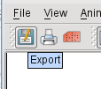

.. _working_with_graphical_output:

Working with graphical output
#############################

**Download**

.. list-table::

  * - **File**
    - **Modified**

  * - File `graphics formats.tar.gz <https://confluence.ecmwf.int/download/attachments/45754147/graphics formats.tar.gz?api=v2>`_
    - Mar 19, 2015 by `Iain Russell <https://confluence.ecmwf.int/display/~cgi>`_

Overview
********

You have seen already how to either visualise your processed data on the display or save it to a file. 
Most processing you will do with Metview will lead to a visualisation you might want to save, either to publish it on web pages or in reports, or simply to keep records. 
This session will give you more information on how you can save and customise your visualisations.

Output formats
==============

All graphical output formats are generated through ECMWF's graphics library `Magics <https://confluence.ecmwf.int/display/MAGP/Magics>`_. 
This means that all graphical capabilities in Metview depend on what Magics offers. 
Detailed descriptions of the output formats and their settings can be found in the `Magics reference documentation <https://software.ecmwf.int/wiki/display/MAGP/Reference+guide>`_.

The table below gives you a list of all the formats that Magics/Metview support and how you can use them.

.. list-table::

  * - **Format**
    - **parameter**
    - **How to visualise**
    - **What to use for**

  * - Qt/screen
    - 
    - Metview display window
    - Interactive usage within Metview

  * - PostScript
    - ps/eps
    - *okular*, *ghostscript/gv*
    - Printing, publications

  * - PDF
    - pdf
    - *okular*, *acroread*
    - Web, archiving, printing

  * - PNG
    - png
    - web browsers, *display*, *xv*
    - Web, presentations -> animations

  * - SVG
    - svg
    - web browsers, vector graphics editor (e.g. `Inkscape <https://inkscape.org/en/>`_)
    - Web HTML5, for further editing in drawing programs

  * - KML/KMZ
    - kml
    - *Google Earth*, *Google Maps*, *OpenLayers*
    - Interactive (non-scientific) publications

The KML output format
=====================

KML is a very special output format. 
It has no notion of output size since it is displayed on the globe. 
KMZ is the compressed version of the KML files and is written by default. 
You can write out the uncompressed KML if you want to debug the output.

.. note::

  **Be careful**
   
  The KML output is still **experimental** and we look for feedback on it. 
  KML can **only** be generated if the *Cylindrical* projection is used!
  

Metadata
========

When a large number of plots are generated it is often hard to find later plots with specific contents. 
What can help is to store additional information with the plots to describe what the content is. 
These descriptions about the content are called Metadata. 
Magics/Metview support the saving of such metadata when the format allows this. 
Especially in text/XML based formats, such as Postscript and SVG, you can use simple UNIX tools like *grep* to search the files for specific keywords.

How to save your visualisations
*******************************

Here we quickly describe how you can save your displays from the interactive plot window or save them within Macros.

Exporting from the plot window
==============================

Whenever you have a plot window open, you are able to **export** the plot into other file formats. 
You can select the export option, either from the toolbar button (it looks like a floppy disk with a pen), or from the **File** menu. 
The keyboard shortcut is **Ctrl+s**.

You will be presented with a dialogue (shown below) similar to what is used by other programs to choose a location and filename for the saved output.
You can select which pages you want to save (if you have a series of them), which format and if you want to edit any format-specific options.

If you select the "spanner" icon

, you are offered an editor to choose format specific options. The example below shows the options for the KML format.

Tasks
-----

1. From an open display window, try to save your plot as a PDF.
2. Now try to save your plot as an SVG with and without fixed dimensions.
   a. Open both files in Firefox and see how the plots behave when you resize the browser window.
   b. Open one of the SVGs in inkscape and edit the images (for example add some text) and save it as a PDF.

Setting output formats in macro code
====================================

The following piece of code shows the simplest way to save your plot as a PDF file instead of creating an interactive Display Window.

.. code-block:: python

  # set up the output format
 
  pdf = pdf_output(
      output_name : "my_plot"
  )
  setoutput(pdf)
  
  data = read("z500.grib")
  plot(data)  #  the plot will be sent to the PDF file
  
Try it!

The ``pdf_output()`` function defines how a PDF file should be generated. 
More options are available to further customise it. 
The ``setoutput()`` function selects this output format. 
So our code can contain many output format definitions and then select just one (or more) with the ``setoutput()`` function at run-time (see later).

The following code example shows how to set multiple output formats at the same time and also set various parameters for the different output formats. Note that in most cases the default values are sufficient. 
A list of all options can found in the Magics documentation for each format at: `PostScript <https://software.ecmwf.int/wiki/display/MAGP/Postscript+output>`_, `SVG <https://confluence.ecmwf.int/download/attachments/45754147/Screenshot 2015-03-11 21.07.05.png?api=v2&modificationDate=1426108056016&version=1>`_, `PNG <https://software.ecmwf.int/wiki/display/MAGP/PNG+output>`_ and `KML <https://software.ecmwf.int/wiki/display/MAGP/KML+output>`_.

**Seeting multiple outputs in Metview Macro**

.. code-block:: python

  #
  # Setting common output options for multiple formats
  #
  output_common = (
      output_name            : "myOutputTest",   # specify relative or full path
      output_title           : "Map of Z500",    # title used by a viewer
      output_debug           : "ON"              # print extra information
  )
 
  ps = ps_output(
      output_common,
      output_ps_scale        : 0.9,    # scale content to 90%, for some printers
      output_ps_colour_model : "CMYK"  # set colour model to CYMK
  )
 
  png = png_output(
      output_common,
      output_width           : 1000,                 # set width in pixels
      output_cairo_transparent_background : "ON"  # to get transparent PNGs
  )
 
  svg = svg_output(
      output_common,
      output_width        : 1000,                 # set width in pixels
      output_svg_fix_size : "ON",   # this fixes the size to 'output_width'
      output_svg_meta     : "Metview map of Z500",
      output_svg_desc     : "This file was generated for the Training course"
  )
 
  kml = kml_output(
      output_common,
      kml_description : "This file was generated for the Training course",
      kml_author      : "Stephan Siemen",
      kml_link        : "http://www.ecmwf.int",
      kml_latitude    : 30,     # latitude where Google Earth centres the view
      kml_longitude   : 120,    # longitude where Google Earth centres the view
      kml_coastlines  : "OFF"
  )
 
  output_drivers = [ps, png, svg, kml]
 
  setoutput(output_drivers)
 
  data = read("z500.grib")
 
  plot(data)

Setting output dependent on runmode
===================================

Depending on how you run your Macros you might want to specify various output formats. 
For example, you might sometimes open your output in the display window, while you might like to save it to a PNG file when you run your Macro in batch. The way to code run mode dependent outcomes is by using the function **runmode()**. 
It returns a string with the run mode:

.. code-block:: python
  
  mode = runmode()
  
So it is enough to check this string and to code accordingly, either using if/else conditions or the case/of condition test. 
To introduce the new functionality, replace the existing unconditional call to *setoutput()* by the following lines of code :

**Example for runmode**

.. code-block:: python

  # check run mode
  mode = runmode()
 
  # select outcome dependent on run-mode
  if(mode = "execute")
    then setoutput(png)
  else if (mode = "batch")
    then setoutput(ps)
  else if (mode = "visualise")
    then print('Plotting to screen')  # for screen do nothing
  else if (mode = "prepare")
    then print('Plotting to screen')  # for screen do nothing
  else
    fail("Only execute, batch and visualise allowed")
  end if

Now, depending on how you call the macro, your output will be directed to different media. 
Choose different options from the icon's right-click menu to see what happens. 
Note that you can also simulate these actions from within the Macro editor ( *Program* | *Run Options*). 
The 'prepare' run mode is the default one when you run your macro from the Macro editor. 
The 'batch' run mode will be explained in a later paragraph.

If you select an option not covered by the allowed run modes (e.g. Save or Examine), the macro will stop, turn red (failed run) and issue an error message - this behaviour is provided by the *fail()* function. 
A related function, *stop()*, will do the same but allow the macro to exit in the green state (successful run). 

To run the macro in batch mode, you call Metview with the option -b followed by the macro name on the command line (assuming you are running from the same directory as the macro - otherwise you must provide a path to it) or in shell scripts. 
For example:

.. code-block:: python

  metview -b mymacro.mv

Task
----

Create a new *Macro* icon and rename it outputs. 
Write a small macro to read the file *z500.grib* and plot it. 
If the macro is run in batch mode, the plot should be saved as a PDF file somewhere into /tmp; otherwise, plot it to a PNG file.

1. Run the code in the Macro Editor and see what happens if your execute the macro.
2. Go on the command line and change to the directory where the macro is located. 
   Execute the macro from the command line outside Metview.

Pages and page layout
=====================

Some graphical formats, such as PostScript and PDF, allow multiple pages within the documents. Other formats, such as PNG, will contain a single page at the time and therefore contain a number in their filename to indicate which page they contain. If you plot, for example, a fieldset with 3 fields to a PostScript file,  it will contain 3 pages - each field is plotted into the same view, but on a different page.

You can also trigger a new page in Metview Macro with the function

.. code-block:: python

  newpage(...)

This function is normally used within loops to generate output of each iteration on a separate page (or file). 
It is the only way to use different views on different pages - this is the main purpose of it.

To use ``newpage()`` you need first to define a ``plot_superpage()`` as shown in the example below.

**Multiple pages**

.. code-block:: python

  ...
  
  dw = plot_superpage(
    pages : [plot_page()] #  use default page
  )
 
  plot(dw, ...)
  newpage(dw)
  
  ...
  plot(dw, ...)
  
Here we create a default sized page with ``plot_page()``, which attaches to the super page. 
Than we assign each plot command to a page.

Task
----

Take the macro from the previous task and modify it to produce a 2-page output: the first page should be on a default Geographic View, the second should be over Europe only. Only plot the first field in the data. The result should be 2 PNG files or a 2-page PDF, depending on how you run the macro.

Further processing outside Metview
**********************************

Of course you can do further processing of plots outside Metview. 
The page `Generating animated GIFs from Metview plots <https://software.ecmwf.int/wiki/display/METV/Generating+animated+GIFs+from+Metview+plots>`_ gives you some helpful advice if you want to build animations.

Metview/Magics also supports special tags in SVG for the `Inkscape <https://inkscape.org/>`_ graphical editor. 
This open source editor is great for when you need to further annotate your maps.

If you have extra time
======================

If you have time, you might want to try opening your SVG file from the first exercise above in inkscape and alter it and save it to a PNG.
