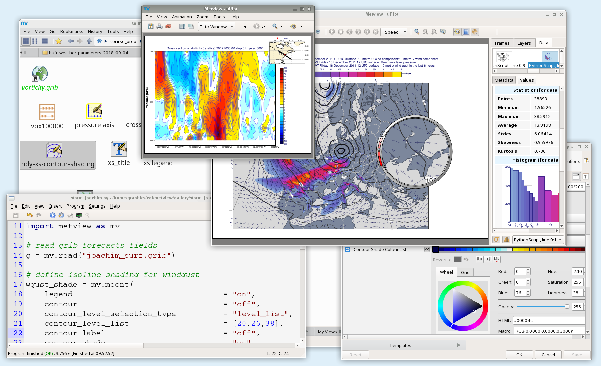

Metview
====================================

**Metview** is a meteorological workstation application designed to be a complete working environment
for both the operational and research meteorologist. Its capabilities include powerful data access,
processing and visualisation. It features both a powerful **icon-based user interface** for
interactive work and a **Python** interface for batch processing.

Metview was developed as part of a cooperation between ECMWF and INPE (Brazilian National Institute for Space Research).

.. toctree::
   :maxdepth: 1
   :caption: Examples
   :titlesonly:

   gen_files/gallery/index
   notebook_gallery

.. toctree::
   :maxdepth: 1
   :caption: Documentation

   overview
   metview/using_metview/index
   python
   metview/macro/index.rst
   resources/index.rst
   tutorials/index
   faq

.. toctree::
   :maxdepth: 1
   :caption: Installation  
   
   install
   mv_build/index
   release_notes/index
   licence.rst

Indices and tables
==================

* :ref:`genindex`

.. * :ref:`modindex`
.. * :ref:`search`
